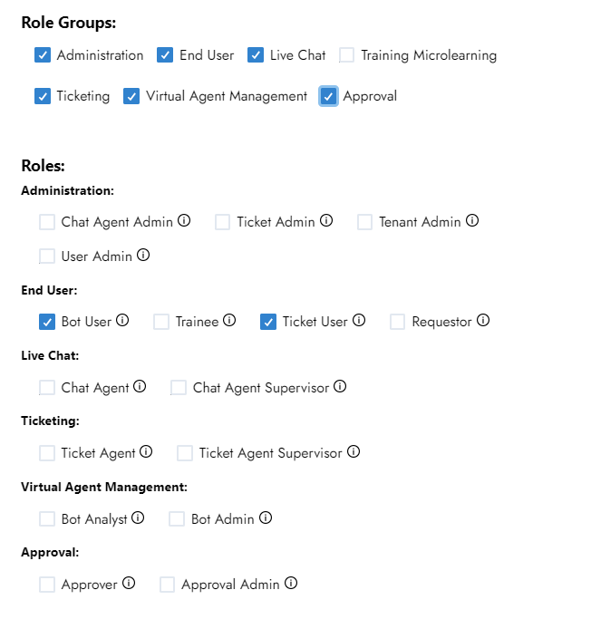

# Roles

| Role Name | Short Description | Module | Permissions |
| --- | --- | --- | --- |
| Tenant Admin | Complete system administrator with access to all features and settings | All | All |
| Bot User | End user who can interact with the virtual agent for questions and service requests | Bot/VirtualAgent | All |
| Ticket User | End user who can create, view, and update their own tickets | Ticketing | All |
| Ticket Agent | Support staff who handle and resolve tickets assigned to them | Ticketing | All |
| Ticket Agent Supervisor | Oversees ticket agents, manages queues, and has expanded ticket management capabilities | Ticketing | All |
| Ticket Admin | Configures and manages the entire ticketing system including templates and workflows | Ticketing | All |
| Live Chat Agent | Handles real-time conversations with users through the chat interface | Live Chat | All |
| Live Chat Supervisor | Monitors chat agents, reviews conversations, and manages chat operations | Live Chat | All |
| Live Chat Admin | Configures chat system settings, queues, and routing rules | Live Chat | All |
| Knowledge Analyst | Reviews and analyzes knowledge content performance and gaps | Knowledge Management | All |
| Knowledge Admin | Creates, manages, and optimizes all knowledge content and sources | Knowledge Management | All |
| Bot Analyst | Monitors bot performance, reviews conversations, and analyzes metrics | Creator Studio and Bot Management | All |
| Bot Admin | Designs, configures, and manages bot behaviors and capabilities | Creator Studio and Bot Management | All |

