# Single Sign-On Configuration

This guide provides detailed instructions for configuring Single Sign-On (SSO) authentication for your platform, supporting both SAML and OAuth protocols.

### Oauth Setup 

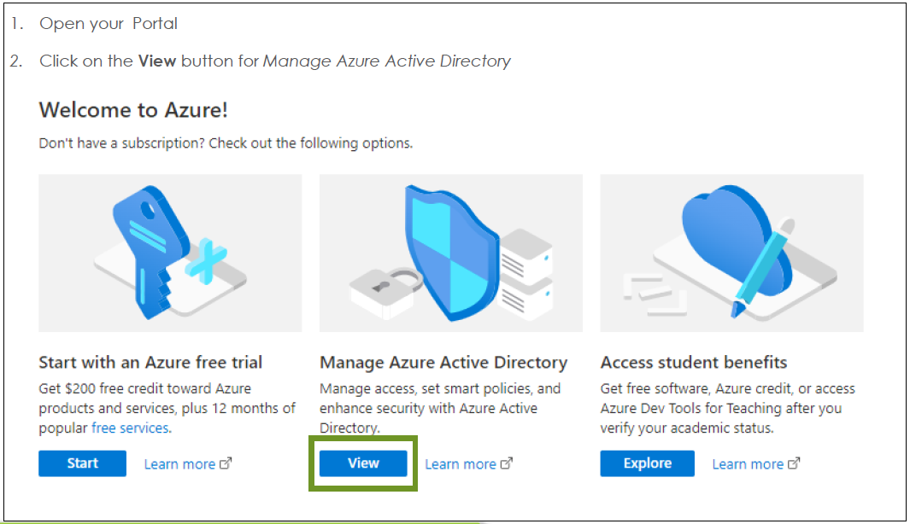

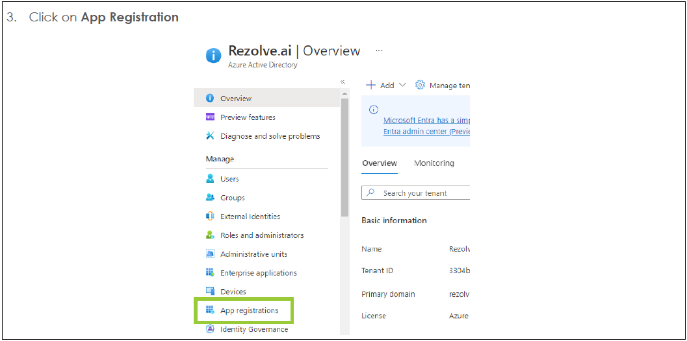

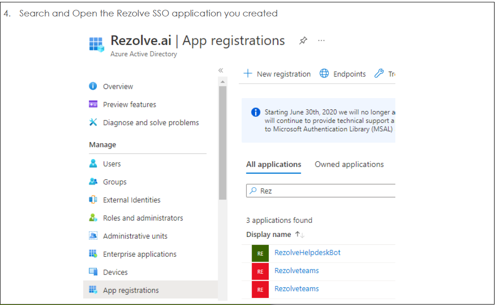

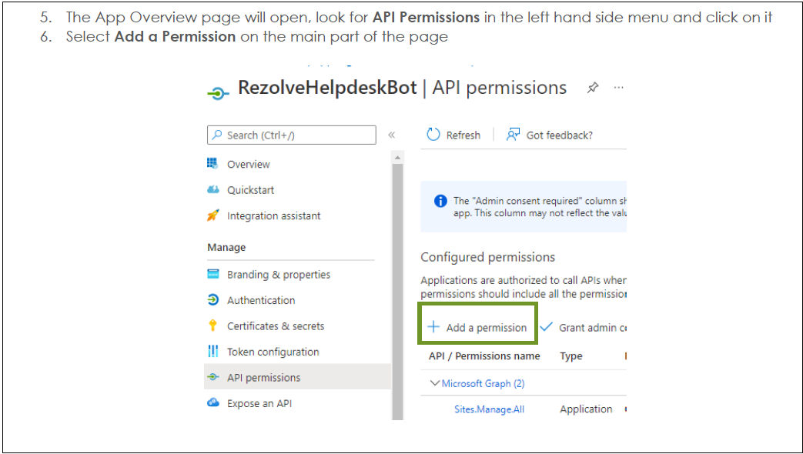

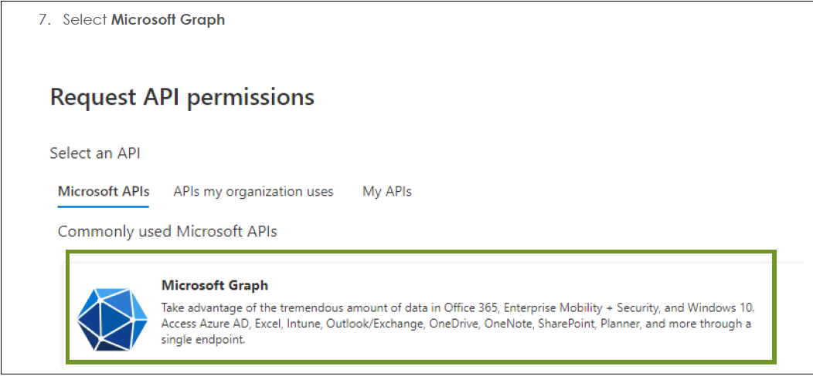

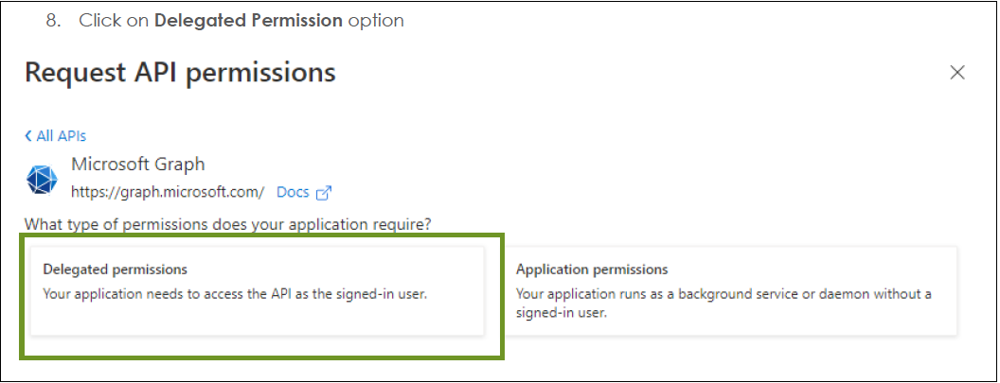

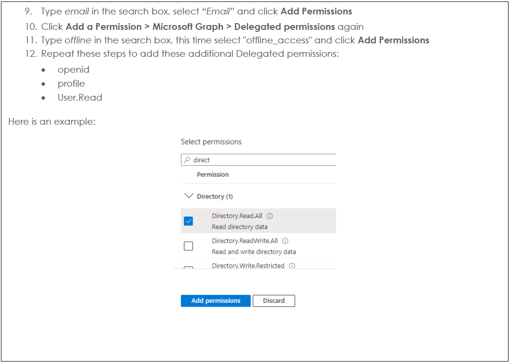

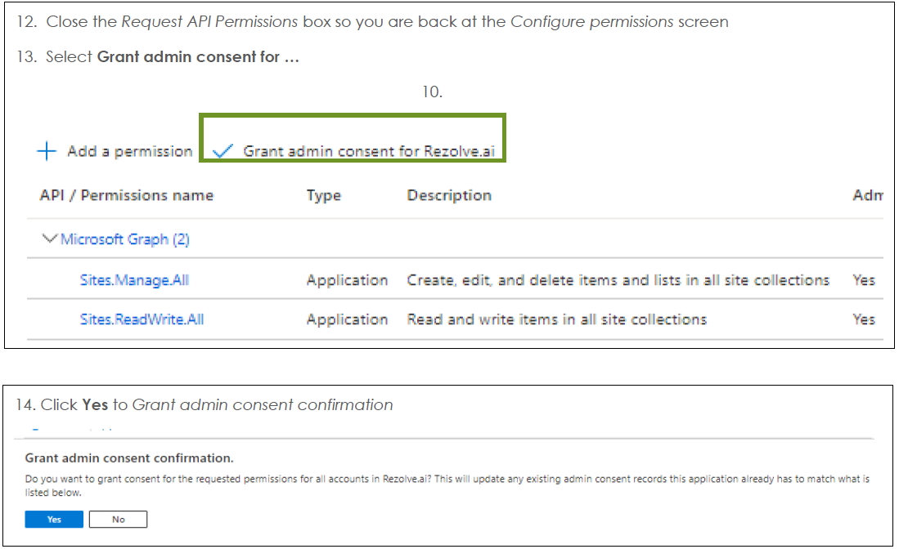

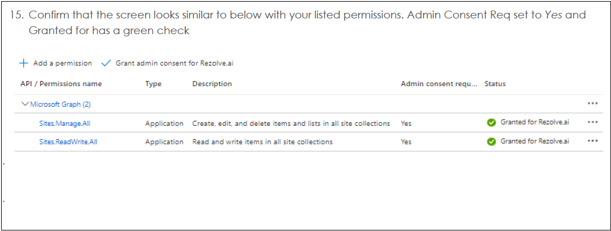

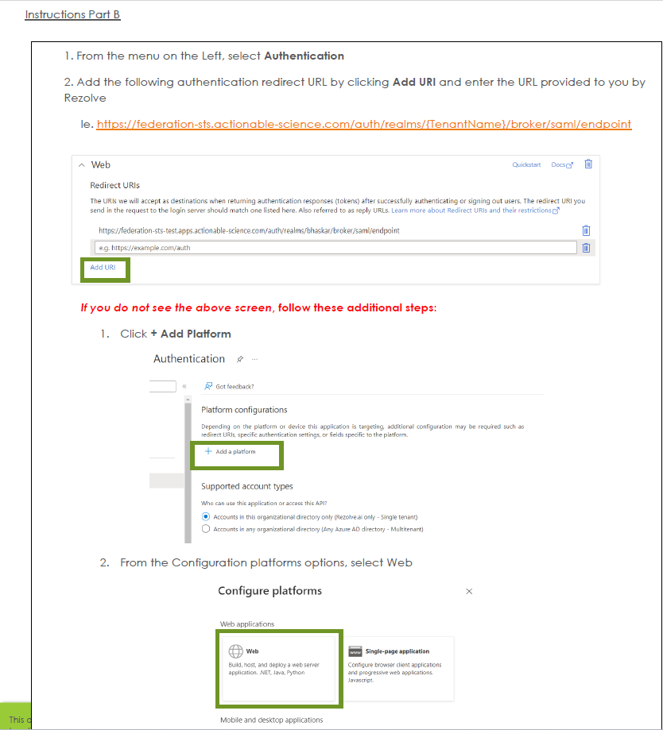

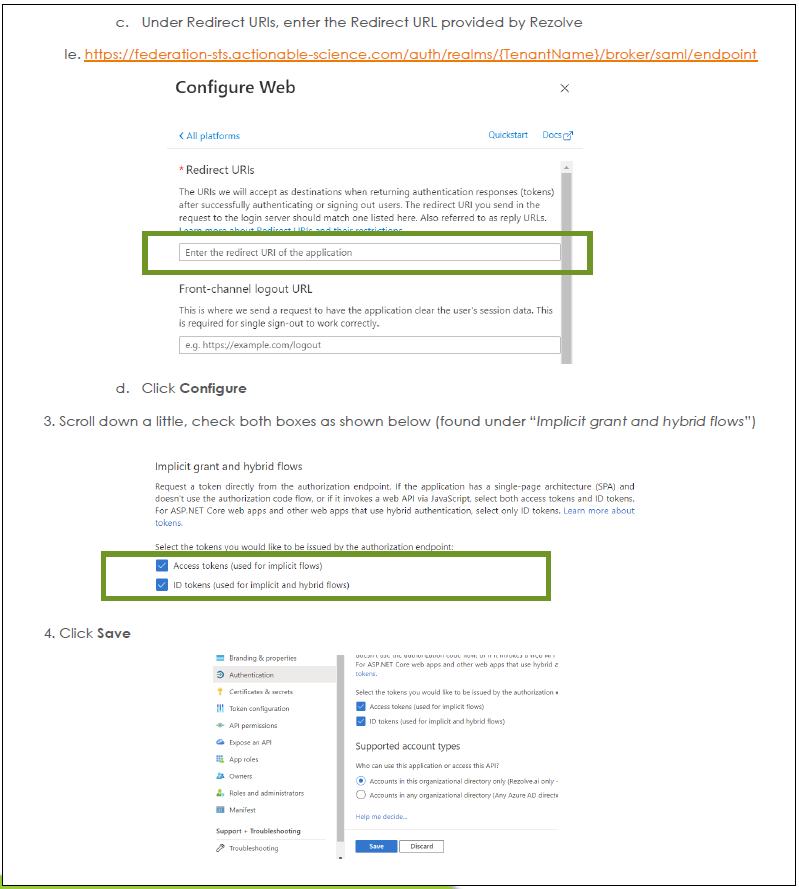

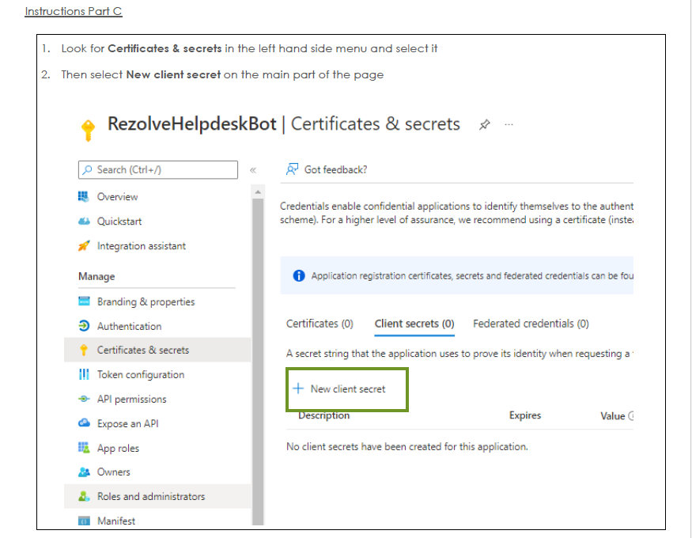

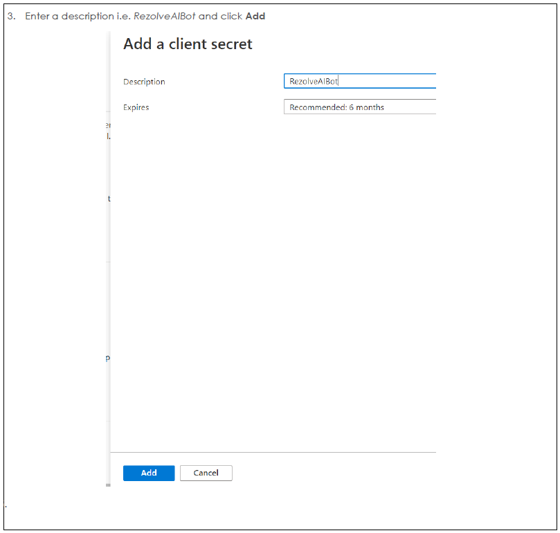

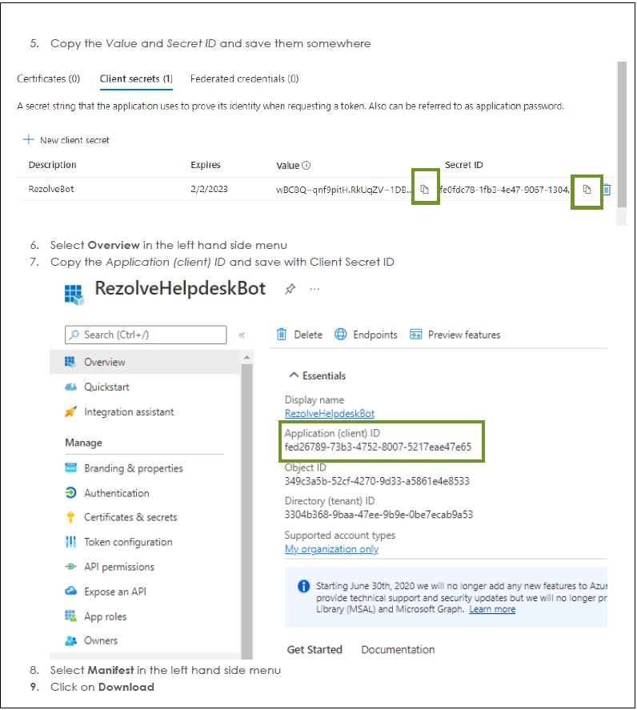

