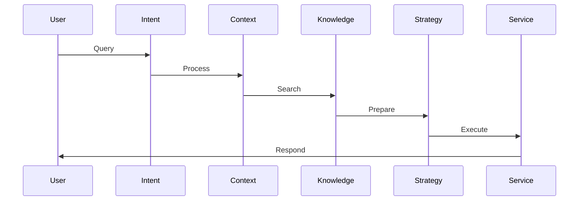

# Bot Agents

Detailed documentation of AITSM's specialized AI bot agents and their capabilities.

## Overview

AITSM's bot agents are specialized AI components that handle specific aspects of service management interactions.

_Suggested Image: "bot-agents-overview.png" - Overview of all bot agents and their relationships_

## Core Agents

### 1. Intent Action Agent {#intent-action-agent}
Purpose: Understands user intent and triggers appropriate actions.

Capabilities:
- Intent classification
- Entity extraction
- Action mapping
- Context preservation

_Suggested Image: "intent-action-flow.png" - Intent processing workflow_

### 2. Strategy Response Agent {#strategy-response-agent}
Purpose: Determines the best response strategy for user queries.

Features:
- Response prioritization
- Channel optimization
- Format selection
- Tone adjustment

_Suggested Image: "strategy-response.png" - Response strategy selection process_

### 3. Contextual Conversation Agent {#contextual-conversation-agent}
Purpose: Maintains conversation context and ensures coherent dialogue.

Functions:
- Context tracking
- Memory management
- Reference resolution
- Thread management

_Suggested Image: "context-management.png" - Context handling diagram_

## Knowledge Agents

### 1. Intelligent Knowledge Agent {#intelligent-knowledge-agent}
Purpose: Manages knowledge retrieval and presentation.

Capabilities:
- Semantic search
- Relevance ranking
- Content adaptation
- Source verification

### 2. Knowledge Result Agent {#knowledge-result-agent}
Purpose: Processes and presents knowledge base results.

Features:
- Result formatting
- Snippet generation
- Link management
- Related content

### 3. Structured Content Agent {#structured-content-agent}
Purpose: Handles structured data presentation.

Functions:
- Template matching
- Data formatting
- Layout optimization
- Dynamic content

_Suggested Image: "knowledge-agents.png" - Knowledge agent interaction flow_

## Service Agents

### 1. Service Dialogue Agent {#service-dialogue-agent}
Purpose: Manages service-related conversations.

Capabilities:
- Service identification
- Request clarification
- Process guidance
- Status updates

### 2. Web Intelligence Agent {#web-intelligence-agent}
Purpose: Handles web-based interactions.

Features:
- Web form handling
- Session management
- Navigation assistance
- Data validation

_Suggested Image: "service-agents.png" - Service agent architecture_

## Ticket Management Agents

### 1. Support Ticket Agent {#support-ticket-agent}
Purpose: Manages ticket-related operations.

Functions:
- Ticket creation
- Status updates
- Priority assignment
- Route selection

### 2. Ticket Triage Agent {#ticket-triage-agent}
Purpose: Performs initial ticket assessment and routing.

Capabilities:
- Category assignment
- Priority assessment
- Team selection
- SLA determination

### 3. Ticket Offer Agent {#ticket-offer-agent}
Purpose: Suggests relevant solutions and offers.

Capabilities:
- Solution matching
- Offer selection
- Resource suggestion
- Alternative options

### 4. Ticket Close Agent {#ticket-close-agent}
Purpose: Manages ticket closure process.

Functions:
- Resolution verification
- Satisfaction check
- Documentation
- Knowledge capture

_Suggested Image: "ticket-agents.png" - Ticket agent workflow_

## Agent Interaction

### 1. Communication Flow

### 2. Data Sharing
- Context passing
- State management
- Data persistence
- Event propagation

_Suggested Image: "agent-interaction.png" - Agent communication diagram_

## Performance Optimization

### 1. Response Time
- Parallel processing
- Caching
- Load balancing
- Priority queuing

### 2. Accuracy
- Model updates
- Training data
- Validation rules
- Feedback loops

_Suggested Image: "performance-metrics.png" - Performance optimization techniques_

## Best Practices

1. Agent Configuration
   - Clear boundaries
   - Focused responsibilities
   - Error handling
   - Logging

2. Integration
   - Clean interfaces
   - State management
   - Error propagation
   - Monitoring

_Suggested Image: "agent-best-practices.png" - Best practices checklist_

## Related Topics
- [Bot Architecture](../core-concepts/bot)
- [Using the Bot](../getting-started/using-bot)
- [Custom Agents](custom-agents)
- [Email Agents](email-agents)
