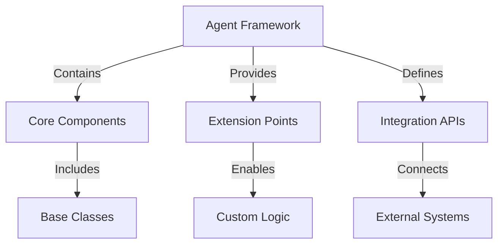
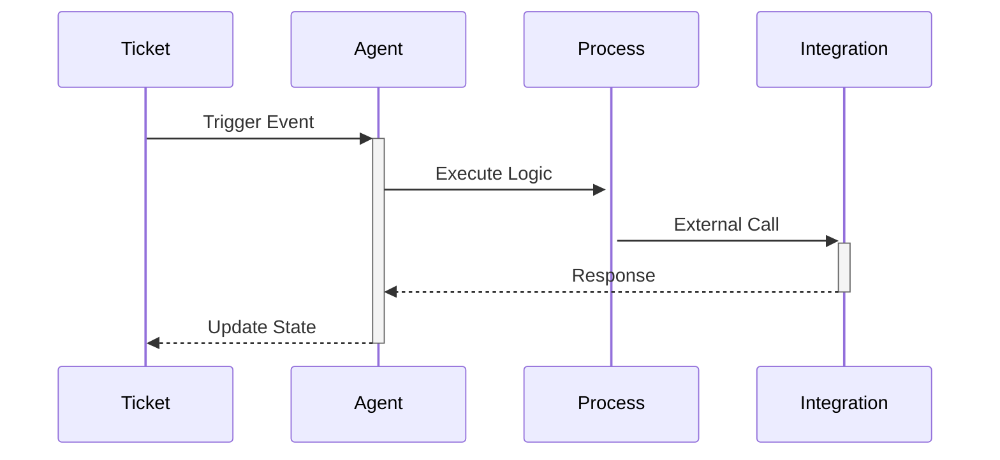

# Custom Agents

Learn how to build, deploy, and manage custom AI agents in Rezolve.ai.

## Overview

Rezolve.ai provides a flexible framework for creating custom AI agents to extend platform capabilities and automate specific business processes.

_Suggested Image: "custom-agents-overview.png" - Custom agents framework architecture_

## Building Custom Agents

### 1. Agent Framework


Components:
- Base classes
- Extension points
- Integration APIs
- Utility functions

_Suggested Image: "agent-framework.png" - Framework components diagram_

### 2. Development Process
Steps:
1. Requirements analysis
2. Agent design
3. Implementation
4. Testing
5. Deployment
6. Monitoring

_Suggested Image: "development-process.png" - Development lifecycle_

## Agent Types

### 1. Process Automation Agents
Purpose: Automate specific business processes

Examples:
- Approval workflows
- Resource allocation
- Budget management
- Compliance checking

_Suggested Image: "process-agents.png" - Process automation examples_

### 2. Integration Agents
Purpose: Connect with external systems

Features:
- Data synchronization
- API integration
- Format conversion
- State management

_Suggested Image: "integration-agents.png" - Integration patterns_

### 3. Analysis Agents
Purpose: Perform specialized analysis

Capabilities:
- Data processing
- Pattern recognition
- Trend analysis
- Report generation

_Suggested Image: "analysis-agents.png" - Analysis workflow_

## Deployment Options

### 1. Ticket Process Events


Configuration:
- Event triggers
- Process flow
- Error handling
- State management

_Suggested Image: "ticket-deployment.png" - Ticket process flow_

### 2. Knowledge Process Events
Integration points:
- Content creation
- Update triggers
- Review process
- Publication workflow

_Suggested Image: "knowledge-deployment.png" - Knowledge process integration_

### 3. Scheduled Tasks
Features:
- Timing configuration
- Resource management
- Dependency handling
- Error recovery

_Suggested Image: "scheduled-tasks.png" - Task scheduling interface_

## Development Tools

### 1. Agent SDK
Components:
- Core libraries
- Development tools
- Testing framework
- Documentation

### 2. Development Environment
Tools:
- IDE integration
- Debugging tools
- Local testing
- Performance profiling

_Suggested Image: "development-tools.png" - Development environment_

## Testing and Quality

### 1. Testing Framework
Features:
- Unit testing
- Integration testing
- Performance testing
- Load testing

### 2. Quality Assurance
Processes:
- Code review
- Security audit
- Performance analysis
- Compliance check

_Suggested Image: "testing-framework.png" - Testing components_

## Performance Optimization

### 1. Resource Management
- CPU optimization
- Memory management
- Network efficiency
- Storage optimization

### 2. Scaling Strategies
- Horizontal scaling
- Load balancing
- Caching
- Queue management

_Suggested Image: "performance-optimization.png" - Optimization strategies_

## Security Considerations

### 1. Authentication
- Identity verification
- Access control
- Token management
- Session handling

### 2. Data Protection
- Encryption
- Data masking
- Audit logging
- Compliance

_Suggested Image: "security-measures.png" - Security implementation_

## Best Practices

### 1. Development
- Modular design
- Clean code
- Documentation
- Version control

### 2. Deployment
- Staged rollout
- Monitoring setup
- Backup procedures
- Recovery plans

### 3. Maintenance
- Regular updates
- Performance monitoring
- Security patches
- Documentation updates

_Suggested Image: "best-practices.png" - Best practices checklist_

## Troubleshooting

### Common Issues
1. Development Issues
   - Build errors
   - Integration problems
   - Performance issues
   - Security concerns

2. Runtime Issues
   - Execution errors
   - Resource constraints
   - Integration failures
   - State inconsistencies

_Suggested Image: "troubleshooting-guide.png" - Troubleshooting flowchart_

## Example Implementations

### 1. Custom Approval Agent
```javascript
class ApprovalAgent extends BaseAgent {
    async processRequest(request) {
        // Implementation details
    }
}
```

### 2. Data Integration Agent
```javascript
class DataSyncAgent extends BaseAgent {
    async syncData(source, target) {
        // Implementation details
    }
}
```

_Suggested Image: "example-implementations.png" - Code examples_

## Related Topics
- [Knowledge Agents](knowledge-agents)
- [System Integration](../core-concepts/integrations)

