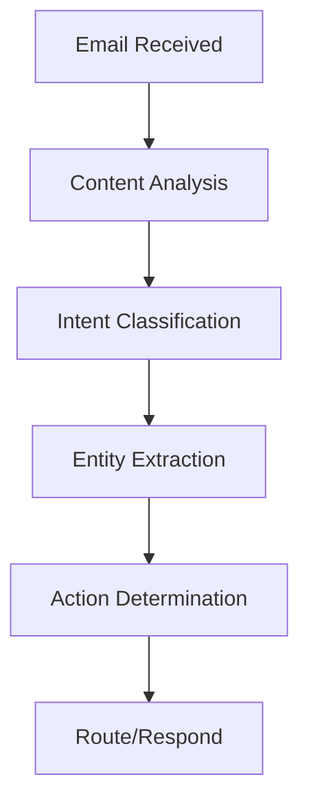
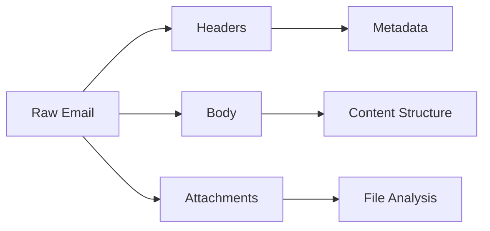

# Email Agents

Understanding Rezolve.ai's AI-powered email processing and management capabilities.

## Overview

Rezolve.ai's email agents provide intelligent email processing and automated response management for service desk operations.

_Suggested Image: "email-agents-overview.png" - Email processing system architecture_

## Core Email Agents

### 1. Intent Action Agent
Purpose: Analyzes email content to determine user intent and required actions.

Capabilities:
- Content analysis
- Intent classification
- Priority detection
- Action mapping

_Suggested Image: "email-intent-flow.png" - Email intent processing workflow_

### 2. Ticket Parser Agent
Purpose: Extracts and structures information from emails for ticket creation and updates.

Features:
- Header analysis
- Body parsing
- Attachment handling
- Metadata extraction
- Thread tracking

_Suggested Image: "ticket-parser-components.png" - Parser component diagram_

## Email Processing Pipeline

### 1. Initial Processing
- Email reception
- Spam filtering
- Format validation
- Thread association

### 2. Content Analysis
- Language detection
- Sentiment analysis
- Urgency assessment
- Category classification

### 3. Information Extraction

_Suggested Image: "information-extraction.png" - Information extraction process_

## AI Capabilities

### 1. Smart Classification
- Request type identification
- Service categorization
- Department routing
- Priority assignment

### 2. Content Enhancement
- Format standardization
- Language correction
- Content structuring
- Tag generation

### 3. Response Generation
- Template selection
- Content personalization
- Attachment handling
- Signature management

_Suggested Image: "ai-capabilities.png" - AI feature diagram_

## Integration Features

### 1. Ticket System Integration
- Automatic ticket creation
- Update processing
- Status synchronization
- Comment handling

### 2. Knowledge Base Integration
- Article suggestions
- Solution matching
- FAQ integration
- Documentation links

### 3. Workflow Integration
- Process triggers
- Task creation
- Notification management
- SLA tracking

_Suggested Image: "integration-points.png" - Integration architecture_

## Email Management

### 1. Queue Management
- Priority queuing
- Load balancing
- SLA monitoring
- Routing rules

### 2. Thread Management
- Conversation tracking
- Reply correlation
- History preservation
- Status tracking

_Suggested Image: "email-management.png" - Management console interface_

## Security Features

### 1. Email Security
- Spam detection
- Phishing protection
- Content validation
- Attachment scanning

### 2. Data Protection
- Email encryption
- Data masking
- Privacy controls
- Compliance checks

_Suggested Image: "security-measures.png" - Security implementation diagram_

## Performance Optimization

### 1. Processing Speed
- Parallel processing
- Batch handling
- Caching strategies
- Resource optimization

### 2. Accuracy Improvement
- Learning from corrections
- Pattern recognition
- Validation rules
- Quality checks

_Suggested Image: "performance-metrics.png" - Performance dashboard_

## Best Practices

### 1. Configuration
- Email server setup
- Filter configuration
- Rule management
- Template design

### 2. Maintenance
- Regular monitoring
- Performance tuning
- Rule updates
- Template refresh

### 3. Training
- Agent training
- Pattern updates
- Response optimization
- Error correction

_Suggested Image: "best-practices.png" - Best practices checklist_

## Troubleshooting

### Common Issues
1. Email Processing
   - Delivery issues
   - Parse errors
   - Classification problems
   - Integration failures

2. Performance Issues
   - Processing delays
   - Queue bottlenecks
   - Resource constraints
   - Integration timeouts

_Suggested Image: "troubleshooting-guide.png" - Troubleshooting flowchart_

## Related Topics
- [Ticket Automation](ticket-automation)
- [System Integration](../core-concepts/integrations)
