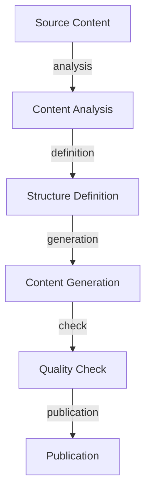
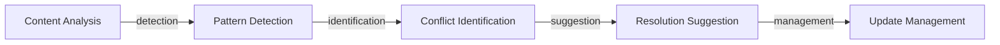

# Knowledge Agents

Understanding Rezolve.ai's AI-powered knowledge management and content generation capabilities.

## Overview

Rezolve.ai's knowledge agents provide intelligent content management, generation, and optimization for your knowledge base.

_Suggested Image: "knowledge-agents-overview.png" - Knowledge agents system architecture_

## Core Knowledge Agents

### 1. Article Generation Agent {#article-generation-agent}
_Purpose_: Automatically creates knowledge articles from various sources.

Features:
- Source analysis
- Content extraction
- Structure optimization
- Format standardization

_Suggested Image: "article-generation-flow.png" - Article generation process_

### 2. Document Summarization Agent {#document-summarization-agent}
_Purpose_: Creates concise summaries of lengthy documents and articles.

Capabilities:
- Key point extraction
- Context preservation
- Length optimization
- Format adaptation

_Suggested Image: "summarization-process.png" - Document summarization workflow_

### 3. Duplicates Detection Agent {#duplicates-detection-agent}
_Purpose_: Identifies and manages duplicate or similar content.

Features:
- Content comparison
- Similarity scoring
- Version tracking
- Merge suggestions

_Suggested Image: "duplicate-detection.png" - Duplicate detection process_

### 4. Conflicts Detection Agent {#conflict-detection-agent}
_Purpose_: Identifies and resolves conflicting information across articles.

Capabilities:
- Content analysis
- Pattern recognition
- Conflict resolution
- Version control

_Suggested Image: "conflict-resolution.png" - Conflict detection workflow_

### 5. Knowledge Graph Parsing Agent {#knowledge-graph-parsing-agent}
_Purpose_: Builds and maintains knowledge relationships and connections.

Features:
- Entity extraction
- Relationship mapping
- Graph building
- Context linking

_Suggested Image: "knowledge-graph.png" - Knowledge graph visualization_

## Content Processing Pipeline

### 1. Content Ingestion
- Source identification
- Format detection
- Content extraction
- Initial processing

### 2. Analysis Phase
- Content classification
- Topic extraction
- Relevance assessment
- Quality evaluation

### 3. Enhancement Phase
- Structure optimization
- Format standardization
- SEO enhancement
- Link generation

_Suggested Image: "content-pipeline.png" - Content processing workflow_

## AI Capabilities

### 1. Natural Language Processing
- Text analysis
- Entity recognition
- Topic modeling
- Sentiment analysis

### 2. Content Intelligence
- Context understanding
- Relationship mapping
- Pattern recognition
- Trend analysis

### 3. Quality Assurance
- Accuracy checking
- Completeness validation
- Style consistency
- Link verification

_Suggested Image: "ai-capabilities.png" - AI features diagram_

## Integration Features

### 1. System Integration
- External sources
- Content management systems

### 2. Workflow Integration
- Content approval
- Publication process
- Review cycles
- Update management

_Suggested Image: "integration-points.png" - Integration architecture_

## Performance Optimization

### 1. Processing Efficiency
- Parallel processing
- Resource management
- Caching strategies
- Queue optimization

### 2. Quality Improvement
- Learning mechanisms
- Feedback loops
- Pattern refinement
- Accuracy tracking

_Suggested Image: "performance-metrics.png" - Performance dashboard_

## Best Practices

### 1. Content Management
- Source validation
- Quality standards
- Update frequency
- Version control

### 2. Knowledge Organization
- Category structure
- Tagging system
- Relationship management
- Access control

### 3. Maintenance
- Regular reviews
- Content updates
- Link verification
- Archive management

_Suggested Image: "best-practices.png" - Best practices checklist_

## Troubleshooting

### Common Issues
1. Content Issues
   - Generation failures
   - Quality problems
   - Integration errors
   - Sync issues

2. Performance Issues
   - Processing delays
   - Resource constraints
   - Integration timeouts
   - Quality degradation

_Suggested Image: "troubleshooting-guide.png" - Troubleshooting flowchart_

## Advanced Features

### 1. Multi-language Support
- Content translation
- Language detection
- Cultural adaptation
- Format localization

### 2. Rich Media Handling
- Image processing
- Video content
- Interactive elements
- Attachment management

### 3. Version Control
- Change tracking
- History management
- Rollback capabilities
- Comparison tools

_Suggested Image: "advanced-features.png" - Advanced features overview_

## Related Topics
- [Custom Agents](custom-agents)
