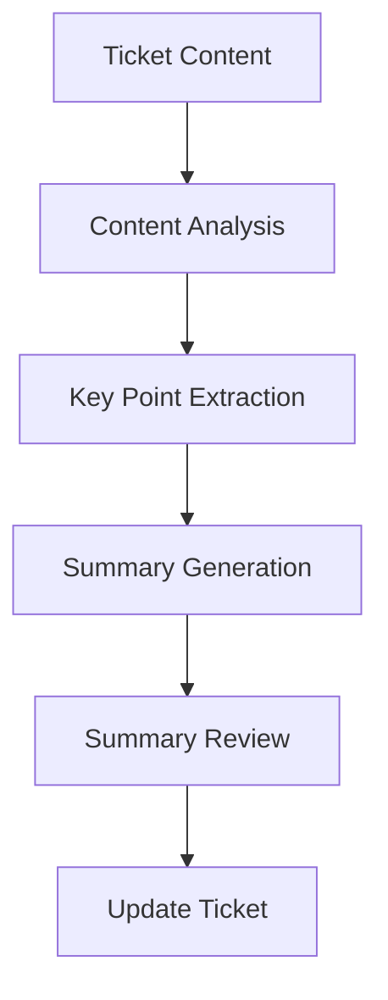
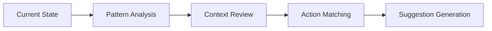

# Standard Ticket Automation Agents

Understanding Rezolve.ai's AI-powered ticket automation capabilities for enhanced service delivery.

## Overview

Rezolve.ai's ticket automation agents provide intelligent processing and management of service tickets throughout their lifecycle.

_Suggested Image: "ticket-automation-overview.png" - Ticket automation system architecture_

## Core Automation Agents

### 1. Summarization Agent {#summarization-agent}
_Purpose_: Automatically generates concise summaries of ticket content and interactions.

Features:
- Content analysis
- Key point extraction
- Context preservation
- Format optimization

_Suggested Image: "summarization-process.png" - Summarization workflow_

### 2. Notes Generation Agent {#notes-generation-agent}
_Purpose_: Creates structured notes from ticket interactions and updates.

Capabilities:
- Interaction analysis
- Action tracking
- Timeline creation
- Update organization

_Suggested Image: "notes-generation.png" - Notes generation process_

### 3. Sentiment Scoring Agent {#sentiment-scoring-agent}
_Purpose_: Analyzes and tracks customer sentiment throughout ticket lifecycle.

Features:
- Text analysis
- Emotion detection
- Trend tracking
- Alert generation

_Suggested Image: "sentiment-analysis.png" - Sentiment tracking dashboard_

### 4. Feedback Scoring Agent {#feedback-scoring-agent}
_Purpose_: Processes and analyzes customer feedback for service improvement.

Capabilities:
- Feedback collection
- Score calculation
- Trend analysis
- Improvement suggestions

_Suggested Image: "feedback-scoring.png" - Feedback analysis workflow_

## Advanced Automation Features

### 1. Next Action Suggestion Agent {#next-action-suggestion-agent}
_Purpose_: Recommends optimal next steps for ticket resolution.

Features:
- Pattern recognition
- Context analysis
- Solution matching
- Priority assessment

_Suggested Image: "next-action-flow.png" - Next action suggestion process_

### 2. Intelligent Knowledge Agent {#intelligent-knowledge-agent}
_Purpose_: Provides relevant knowledge base articles and solutions.

Capabilities:
- Content matching
- Relevance ranking
- Solution suggestion
- Learning adaptation

_Suggested Image: "knowledge-integration.png" - Knowledge agent architecture_

## Automation Workflows

### 1. Ticket Creation
- Template selection
- Field population
- Routing rules
- Priority assignment

### 2. Processing
- Status updates
- Assignment rules
- SLA tracking
- Escalation management

### 3. Resolution
- Solution suggestion
- Closure validation
- Feedback collection
- Knowledge capture

_Suggested Image: "automation-workflow.png" - End-to-end workflow diagram_

## Integration Features

### 1. System Integration
- Knowledge base
- Communication channels
- External systems
- Reporting tools

### 2. Agent Integration
- [Bot Agents](bot-agents)
- [Email Agents](email-agents)
- Custom integrations
- Third-party tools

_Suggested Image: "integration-architecture.png" - Integration points diagram_

## Performance Optimization

### 1. Processing Efficiency
- Parallel processing
- Queue management
- Resource optimization
- Caching strategies

### 2. Accuracy Improvement
- Learning mechanisms
- Validation rules
- Quality checks
- Feedback loops

_Suggested Image: "performance-metrics.png" - Performance dashboard_

## Best Practices

### 1. Configuration
- Agent setup
- Rule definition
- Template design
- Integration settings

### 2. Monitoring
- Performance tracking
- Error detection
- Quality assurance
- Usage analytics

### 3. Maintenance
- Regular updates
- Pattern refinement
- Rule optimization
- Knowledge refresh

_Suggested Image: "best-practices.png" - Best practices checklist_

## Troubleshooting

### Common Issues
1. Processing Issues
   - Automation failures
   - Integration errors
   - Performance problems
   - Data inconsistencies

2. Quality Issues
   - Accuracy problems
   - Relevance issues
   - Context errors
   - Learning gaps

_Suggested Image: "troubleshooting-guide.png" - Troubleshooting flowchart_

## Related Topics
- [Bot Agents](bot-agents)
- [Email Agents](email-agents)
- [Knowledge Agents](knowledge-agents)
- [Workflow Automation](../core-concepts/automation-workflows)
