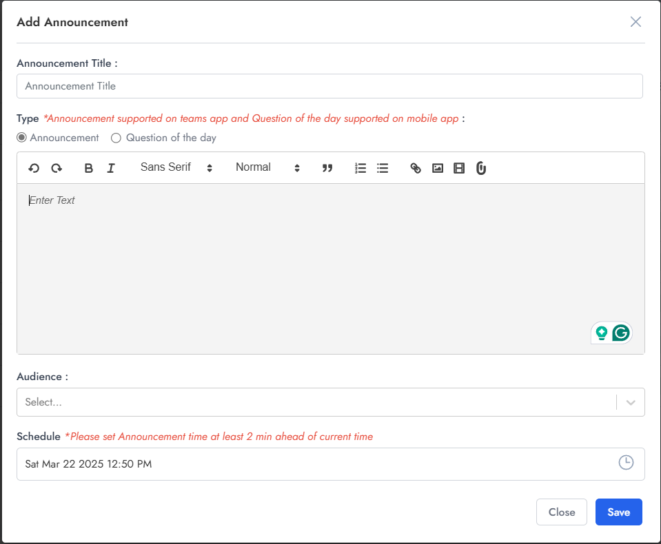
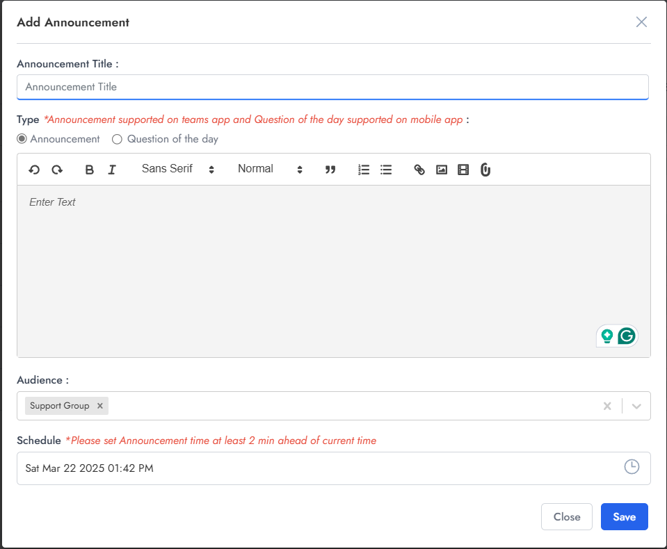

# Creating Announcements

- **Admins(Bot Admins) can create announcements for below Audience:**
  - **Single User**: Target a specific individual user by selecting them from the user directory. Ideal for personalized communications or user-specific updates.

  - **All Bot Users**: Broadcast announcements to every user within the tenant. Perfect for company-wide announcements, policy updates, or system maintenance notifications.
  
  - **Multiple Selected Users**: Choose specific users from a list to receive the announcement. Useful for team-specific communications or targeted updates to selected individuals.
  
  - **Predefined User Groups**: Send announcements to user groups that have been previously configured in the Admin App. Streamlines the process of regularly communicating with established teams, departments, or functional groups.

  

- **Announcements support multiple content formats, including:**
  - Text messages
  - Images
  - Videos
  - GIFs
  - Documents (any file type)

