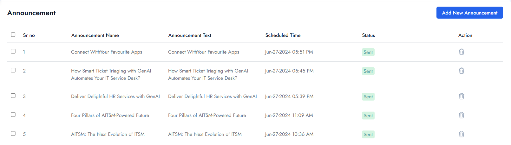

# Announcement Logs

- Admins can track scheduled and delivered announcements within the Virtual Agent Management > Announcements.

- Logs include:
  - **Recipient details** (users/groups targeted).

  - **Delivery status** (Scheduled, Sent).
  
  - **Timestamp** of when the announcement was sent.
  
  - **Content preview** for reference.

