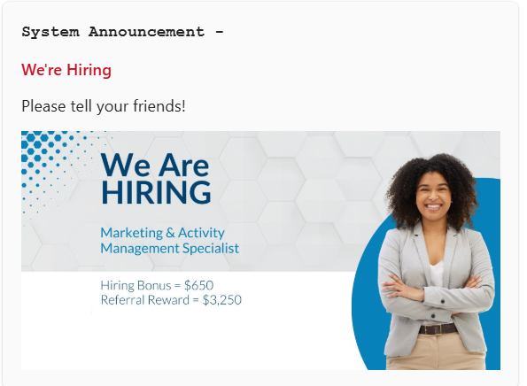

# Scheduling Announcements

Announcements in Rezolve.ai can be scheduled for immediate delivery or for a future date and time. Follow these steps to schedule an announcement:

1. Navigate to Virtual **Agent Management**.
2. Select the **Announcements** section.
3. Choose the recipients (single user, multiple users, all bot users, or user groups).
4. Add content (text, images, videos, GIFs, or documents).
5. Set the **date and time** for the announcement (minimum 2 minutes from the current time).
6. Confirm and schedule the announcement.

## Announcement Visibility

- Scheduled announcements will be delivered via the chatbot on **Microsoft Teams** and **Slack**.

- Users can view announcements in two places:
  - **Announcement cards** displayed during chat conversations.
  
  - The **Announcements tab**, which holds all notifications over time for future reference.

   
