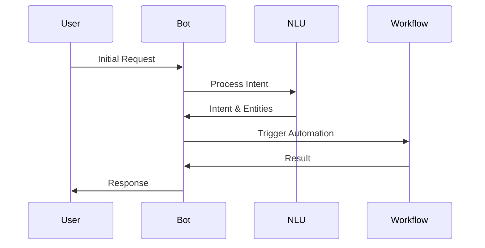

# Automation Workflows

Learn about Rezolve.ai's powerful automation capabilities that streamline your service management processes.

## Overview

Rezolve.ai provides three main types of automation workflows:
1. Bot-driven automation
2. Ticket process event automation
3. Scheduled task automation

_Suggested Image: "automation-types.png" - Overview diagram of automation types_

## Bot-Driven Automation

### 1. Conversation Flow

_Suggested Image: "bot-workflow.png" - Bot conversation workflow diagram_

### 2. Bot Actions
- Ticket creation
- Knowledge search
- Status updates
- Automated resolution

Learn more in [Using the Bot](../getting-started/using-bot)

## Ticket Process Events

### 1. Event Types
- Creation events
- Update events
- Status change events
- Assignment events
- Resolution events

_Suggested Image: "ticket-events.png" - Ticket lifecycle events diagram_

### 2. Event Actions
- Field updates
- Notifications
- Escalations
- Integration triggers
- AI agent invocation

_Suggested Image: "event-actions.png" - Available actions flowchart_

### 3. AI Integration
Events can trigger various AI agents:
- [Summarization Agent](../ai-features/ticket-automation#summarization-agent)
- [Sentiment Scoring](../ai-features/ticket-automation#sentiment-scoring-agent)
- [Next Action Suggestion](../ai-features/ticket-automation#next-action-suggestion-agent)

## Scheduled Tasks

### 1. Task Types
- Data cleanup
- Report generation
- SLA monitoring
- Batch processing
- Integration sync

_Suggested Image: "scheduled-tasks.png" - Types of scheduled tasks_

### 2. Schedule Configuration
- Frequency settings
- Dependency management
- Error handling
- Notification rules

_Suggested Image: "schedule-config.png" - Schedule configuration interface_

## Building Custom Workflows

### 1. Workflow Designer
Visual interface for creating workflows:
- Drag-and-drop actions
- Condition builders
- Variable management
- Testing tools

_Suggested Image: "workflow-designer.png" - Screenshot of workflow designer_

### 2. Custom Actions
- API integration
- Script execution
- Custom function calls
- External system integration

## Best Practices

1. Start Simple
   - Begin with basic workflows
   - Test thoroughly
   - Gradually add complexity

2. Error Handling
   - Define fallback actions
   - Set up notifications
   - Monitor execution

3. Performance
   - Optimize trigger conditions
   - Manage resource usage
   - Monitor execution time

4. Maintenance
   - Regular reviews
   - Version control
   - Documentation

_Suggested Image: "workflow-best-practices.png" - Best practices checklist_

## Integration Points

Workflows can integrate with:
- [Knowledge Base](../getting-started/knowledge-base)
- External systems
- Custom applications

## Related Topics
- [Bot Agents](../ai-features/bot-agents)
- [Custom Agents](../ai-features/custom-agents)
- [System of Records](system-of-records)
