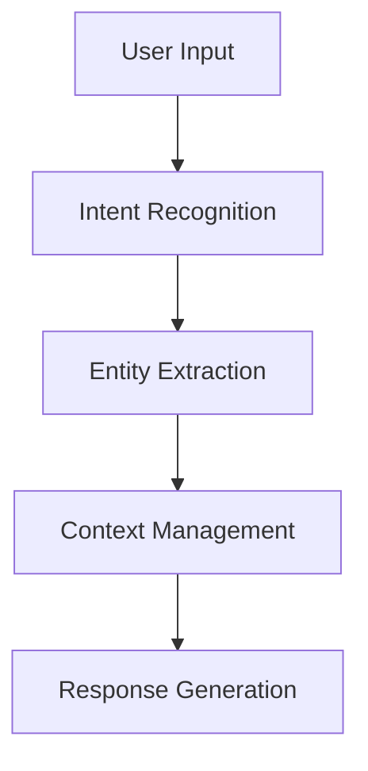
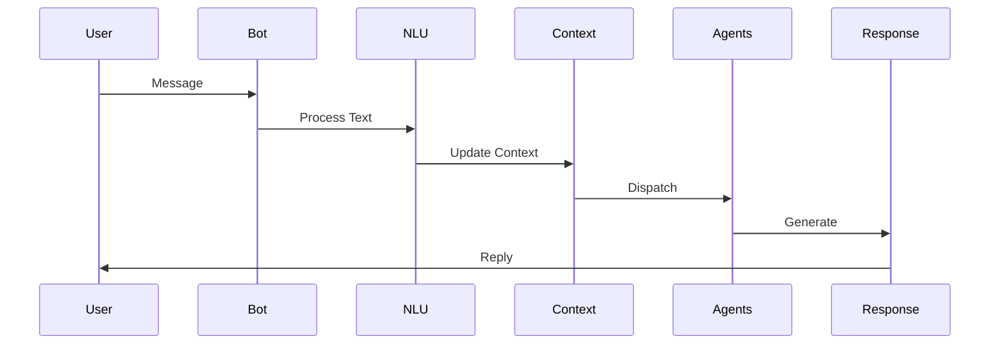

# Bot Architecture

Understanding the core architecture and components of Rezolve.ai's AI-powered bot system.

## Overview

Rezolve.ai's bot system is a sophisticated AI-powered platform that combines multiple specialized agents to provide intelligent service management capabilities.

_Suggested Image: "bot-architecture.png" - High-level bot system architecture_

## Core Components

### 1. Natural Language Understanding

_Suggested Image: "nlu-components.png" - NLU processing flow_

### 2. Conversation Management
- State tracking
- Context preservation
- Session management
- History tracking

_Suggested Image: "conversation-flow.png" - Conversation management diagram_

### 3. Agent Orchestration
- Agent selection
- Task distribution
- Response aggregation
- Fallback handling

_Suggested Image: "agent-orchestration.png" - Agent interaction flow_

## Bot Agents

### 2. Specialized Agents

_Suggested Image: "agent-types.png" - Agent hierarchy and relationships_

## Processing Pipeline

### 1. Input Processing

### 2. Context Management
- User context
- Conversation context
- System context
- Integration context

_Suggested Image: "context-management.png" - Context handling diagram_

## Integration Capabilities

### 1. Channel Integration
- Web widget
- Messaging platforms
- Email
- Custom channels

### 2. System Integration
- External systems

_Suggested Image: "integration-points.png" - Integration architecture_

## AI Features

### 1. Learning Capabilities
- Intent learning
- Response optimization
- Pattern recognition
- Behavior adaptation

### 2. Intelligence Features
- Smart routing
- Priority detection
- Sentiment analysis
- Language understanding

_Suggested Image: "ai-features.png" - AI capabilities diagram_

## Performance Optimization

### 1. Response Time
- Caching strategies
- Load balancing
- Request prioritization
- Async processing

### 2. Accuracy
- Model training
- Validation rules
- Quality checks
- Feedback loops

_Suggested Image: "performance-metrics.png" - Performance optimization diagram_

## Security Features

### 1. Authentication
- User verification
- Session management
- Token handling
- Access control

### 2. Data Protection
- Encryption
- Data masking
- Privacy controls
- Audit logging

_Suggested Image: "security-features.png" - Security implementation diagram_

## Best Practices

1. Bot Design
   - Clear conversation flows
   - Natural dialogue
   - Effective fallbacks
   - User guidance

2. Implementation
   - Modular design
   - Error handling
   - Performance monitoring
   - Regular updates

3. Maintenance
   - Model updates
   - Content refresh
   - Performance tuning
   - Security updates

_Suggested Image: "bot-best-practices.png" - Best practices checklist_

## Related Topics
- [Bot Channels](../integrations/bot-channels)
- [Custom Agents](../ai-features/custom-agents)
