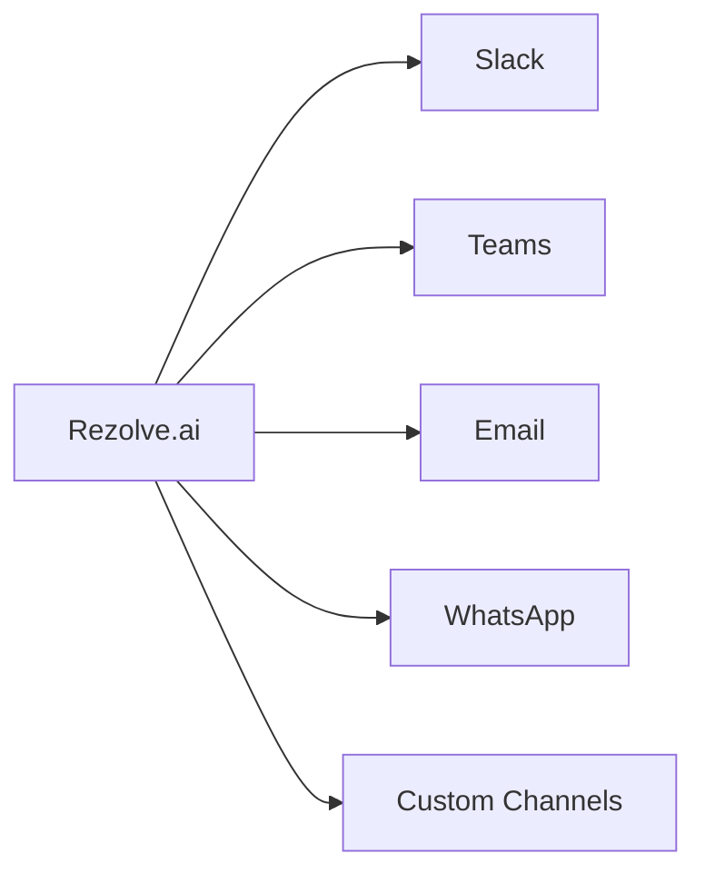

# Integrations

Understanding Rezolve.ai's integration capabilities and how to connect with various external systems.

## Overview

Rezolve.ai provides robust integration capabilities to connect with various enterprise systems and services.

_Suggested Image: "integration-overview.png" - High-level architecture showing integration points_

## Integration Types

### 1. Communication Channels

_Suggested Image: "channel-integrations.png" - Available communication channels_

### 2. Authentication Systems
- Active Directory
- SAML
- OAuth
- Custom SSO

_Suggested Image: "auth-integration.png" - Authentication flow diagram_

### 3. Ticketing Systems
- ServiceNow
- Jira
- Zendesk
- Custom systems

_Suggested Image: "ticket-sync.png" - Ticket synchronization flow_

### 4. Knowledge Bases
- Confluence
- SharePoint
- Custom KB systems
- External documentation

_Suggested Image: "kb-integration.png" - Knowledge base integration architecture_

## Integration Methods

### 1. REST APIs
- API endpoints
- Authentication
- Rate limiting
- Webhooks

_Suggested Image: "api-architecture.png" - API architecture diagram_

### 2. Webhooks
- Event triggers
- Payload structure
- Security
- Retry mechanisms

_Suggested Image: "webhook-flow.png" - Webhook processing flow_

### 3. Custom Connectors
- Connector framework
- Development guide
- Testing tools
- Deployment process

_Suggested Image: "custom-connector.png" - Custom connector architecture_

## AI-Powered Integration Features

### 1. Data Mapping
- Automatic field mapping
- Schema detection
- Transformation rules
- Validation

### 2. Integration Intelligence
- Smart routing
- Context preservation
- Error prediction
- Anomaly detection

_Suggested Image: "ai-integration.png" - AI integration features_

## Security Considerations

### 1. Authentication
- API keys
- OAuth tokens
- Certificates
- IP whitelisting

### 2. Data Protection
- Encryption
- Data masking
- Audit logging
- Compliance

_Suggested Image: "security-measures.png" - Security implementation diagram_

## Best Practices

1. Integration Planning
   - Requirements analysis
   - System compatibility
   - Performance impact
   - Security assessment

2. Implementation
   - Staged rollout
   - Testing strategy
   - Monitoring setup
   - Documentation

3. Maintenance
   - Regular updates
   - Performance monitoring
   - Error handling
   - Backup procedures

_Suggested Image: "integration-checklist.png" - Best practices checklist_

## Related Topics
- [Bot Channels](../integrations/bot-channels)
- [Custom Agents](../ai-features/custom-agents)
