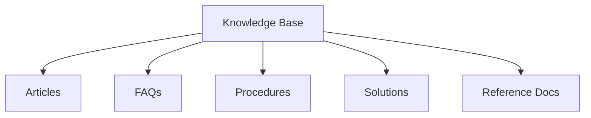
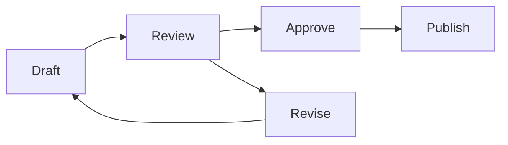

# Knowledge Management

Understanding AITSM's comprehensive knowledge management system and its AI-powered capabilities.

## Overview

AITSM's Knowledge Management system combines traditional knowledge base features with advanced AI capabilities for intelligent content management.

_Suggested Image: "knowledge-system.png" - Knowledge management system architecture_

## Knowledge Structure

### 1. Content Types

_Suggested Image: "content-types.png" - Content type hierarchy_

### 2. Organization
- Categories
- Tags
- Collections
- Relations

_Suggested Image: "kb-organization.png" - Knowledge organization structure_

## AI-Powered Features

### 1. Content Generation
- Automatic article creation
- Content summarization
- FAQ extraction
- Solution synthesis

_Suggested Image: "ai-generation.png" - Content generation workflow_

### 2. Content Enhancement
- SEO optimization
- Readability improvement
- Format standardization
- Link suggestions

_Suggested Image: "content-enhancement.png" - Enhancement process flow_

### 3. Knowledge Graph
- Entity extraction
- Relationship mapping
- Context understanding
- Semantic search

_Suggested Image: "knowledge-graph.png" - Knowledge graph visualization_

## Content Lifecycle

### 1. Creation
- Manual authoring
- AI generation
- Import from tickets
- External sources

### 2. Review Process

### 3. Maintenance
- Version control
- Review schedules
- Archive policies
- Update tracking

_Suggested Image: "content-lifecycle.png" - Content lifecycle diagram_

## AI Agents Integration

### 1. Knowledge Agents
- [Article Generation Agent](../ai-features/knowledge-agents#article-generation-agent)
- [Document Summarization Agent](../ai-features/knowledge-agents#document-summarization-agent)
- [Duplicates Detection Agent](../ai-features/knowledge-agents#duplicates-detection-agent)
- [Knowledge Graph Agent](../ai-features/knowledge-agents#knowledge-graph-parsing-agent)

### 2. Bot Integration
- [Knowledge Result Agent](../ai-features/bot-agents#knowledge-result-agent)
- [Structured Content Agent](../ai-features/bot-agents#structured-content-agent)

## Access Control

### 1. Visibility Levels
- Public
- Internal
- Team-specific
- Role-based

### 2. Permission Types
- View
- Edit
- Approve
- Manage

_Suggested Image: "access-control.png" - Access control matrix_

## Analytics and Reporting

### 1. Usage Analytics
- View counts
- Search analytics
- User feedback
- Resolution rate

### 2. Content Analytics
- Quality metrics
- Coverage analysis
- Gap identification
- Impact assessment

_Suggested Image: "kb-analytics.png" - Analytics dashboard_

## Best Practices

1. Content Quality
   - Clear writing style
   - Regular updates
   - Consistent format
   - Rich media usage

2. Organization
   - Logical structure
   - Clear categories
   - Effective tagging
   - Related content

3. Maintenance
   - Regular reviews
   - Update schedule
   - Feedback loop
   - Version control

_Suggested Image: "kb-best-practices.png" - Best practices checklist_

## Related Topics
- [Knowledge Base Setup](../getting-started/knowledge-base)
- [Knowledge Agents](../ai-features/knowledge-agents)
- [Bot Integration](../getting-started/using-bot)
- [Knowledge Integration](../integrations/knowledge-base)
