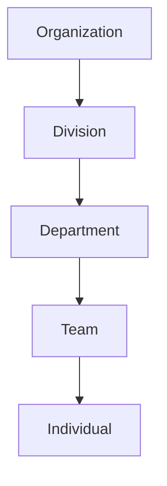

# System of Records

Understanding the core data structures and record types in AITSM.

## Overview

The System of Records in AITSM provides a structured approach to managing various types of service management data.

_Suggested Image: "system-records-overview.png" - High-level diagram showing all record types and their relationships_

## Record Types

### 1. Incidents
- Definition and scope
- Priority levels
- Impact assessment
- Resolution tracking

_Suggested Image: "incident-structure.png" - Diagram showing incident record structure_

### 2. Requests
- Service requests
- Access requests
- Resource requests
- Request fulfillment process

_Suggested Image: "request-workflow.png" - Flowchart of request processing_

### 3. Problems
- Problem identification
- Root cause analysis
- Known error database
- Problem resolution

_Suggested Image: "problem-management.png" - Problem management lifecycle diagram_

### 4. Changes
- Change types
- Risk assessment
- Approval workflow
- Implementation tracking

_Suggested Image: "change-process.png" - Change management process diagram_

## Reference Data

### 1. Configuration Items
- CI types
- Relationships
- Impact mapping
- Dependency tracking

_Suggested Image: "cmdb-structure.png" - CMDB structure diagram_

### 2. Hierarchies

### 3. Intents and Offer Groups
- Service categories
- Intent mapping
- Offer structure
- Group hierarchy

_Suggested Image: "intent-mapping.png" - Intent and offer relationship diagram_

## Metadata Management

### 1. Common Metadata
- Field definitions
- Validation rules
- Relationships
- Dependencies

_Suggested Image: "metadata-structure.png" - Metadata hierarchy diagram_

### 2. Actors and Roles
- Role definitions
- Permission sets
- Access levels
- Role hierarchy

_Suggested Image: "role-hierarchy.png" - Role and permission structure_

## Data Relationships

### 1. Cross-Record Relationships
- Parent-child relationships
- Related records
- Impact relationships
- Dependency mapping

_Suggested Image: "record-relationships.png" - Diagram showing cross-record relationships_

### 2. Hierarchical Structures
- Organizational hierarchy
- Service hierarchy
- Category hierarchy
- Knowledge hierarchy

## Integration Points

The System of Records integrates with:
- [Knowledge Base](../getting-started/knowledge-base)
- [Bot System](../getting-started/using-bot)
- [Service Portal](../getting-started/service-portal)
- External systems

_Suggested Image: "integration-points.png" - System integration diagram_

## Best Practices

1. Data consistency
2. Regular audits
3. Clean data maintenance
4. Relationship management
5. Access control

## Related Topics
- [Automation Workflows](automation-workflows)
- [Knowledge Management](knowledge)
- [Security & Access](../security/roles)
