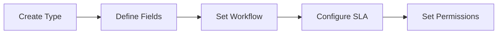

# Ticket Types Configuration

Learn how to configure different ticket types to effectively manage various service requests and incidents.

## Understanding Ticket Types

Ticket types help categorize and route different kinds of service requests and incidents appropriately.

_Suggested Image: "ticket-types-overview.png" - Diagram showing different ticket types and their relationships_

## Standard Ticket Types

### 1. Incident Tickets
- Service disruptions
- System errors
- Access issues

### 2. Service Request Tickets
- Access requests
- Equipment requests
- Software installation

### 3. Problem Tickets
- Root cause analysis
- Recurring issues
- System improvements

### 4. Change Request Tickets
- System changes
- Updates
- Configurations

_Suggested Image: "ticket-type-matrix.png" - Matrix showing ticket types and their characteristics_

## Configuring Ticket Types

### Basic Configuration

_Suggested Image: "ticket-config-screen.png" - Screenshot of ticket type configuration interface_

### Advanced Settings

1. **Custom Fields**
   - Field types
   - Validation rules
   - Dependencies

2. **Workflow Rules**
   - Status transitions
   - Approval flows
   - Automation rules

_Suggested Image: "workflow-config.png" - Screenshot of workflow configuration_

## AI Integration

Ticket types integrate with various AI features:
- [Ticket Triage Agent](../ai-features/bot-agents#ticket-triage-agent)
- [Summarization Agent](../ai-features/standard-ticket-automation-agents#summarization)
- [Next Action Agent](../ai-features/standard-ticket-automation-agents#next-action-suggestion-agent)

## Channel Integration

Configure how tickets are created from different channels:
- [Bot Integration](using-bot)
- [Service Portal](service-portal)
- Email
- API

_Suggested Image: "channel-integration.png" - Diagram showing different integration channels_

## Best Practices

1. Standardize naming conventions
2. Define clear workflows
3. Set appropriate SLAs
4. Configure proper escalations
5. Enable relevant automations

## Monitoring and Analytics

Track ticket type performance:
- Resolution time
- SLA compliance
- Customer satisfaction
- Agent efficiency

_Suggested Image: "ticket-analytics.png" - Screenshot of ticket analytics dashboard_

## Next Steps

After configuring ticket types:
- [Set up Service Portal](service-portal)
- [Configure Bot Integration](using-bot)
- [Monitor Efficiency](bot-efficiency)

## Related Topics
- [System of Records](../core-concepts/system-of-records)
- [Automation Workflows](../core-concepts/automation-workflows)
- [Ticket Automation](../ai-features/ticket-automation)
