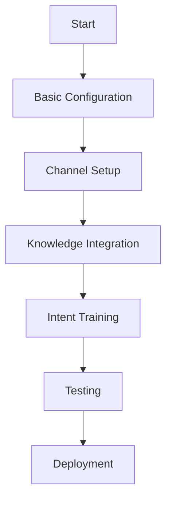

# Use the Bot

This guide will help you understand how to effectively interact with and utilize the virtual agent bot for self-service support and automated assistance.

## Understanding the Virtual Agent

### What is the Virtual Agent?
- Overview of the AI-powered virtual agent
- Capabilities and limitations
- Use cases and benefits
- Integration with knowledge base and helpdesk
- Screenshot of the virtual agent interface

### Bot Channels
- Web widget implementation
- Mobile app integration
- Service portal availability
- Messaging platform integrations (Slack, Teams, etc.)
- Email-based interactions

## Bot Interaction Basics

### Starting a Conversation
- Different ways to initiate a bot conversation
- Welcome message customization
- Initial menu options
- Authentication options for personalized assistance
- Screenshot of conversation initiation

### Asking Questions
- Effective question phrasing
- Natural language capabilities
- Command-based interactions
- Using buttons and quick replies
- Suggested questions navigation

### Understanding Responses
- Types of bot responses
- Knowledge article presentations
- Step-by-step guides
- Decision trees and troubleshooters
- Rich media responses (images, videos, attachments)

### Complex Interactions
- Multi-turn conversations
- Context preservation
- Information collection forms
- Guided workflows
- Handoff to human agents

## Bot Features

### Knowledge Base Access
- How the bot leverages knowledge content
- Article suggestion mechanisms
- Document search capabilities
- Contextual knowledge recommendations

### Ticket Management
- Creating tickets through the bot
- Checking ticket status
- Updating existing tickets
- Adding information to tickets
- Closing resolved issues

### User Authentication
- Secure authentication process
- Personalized assistance based on user profile
- History-aware interactions
- User preference retention

### Interactive Tools
- Decision trees
- Troubleshooters
- Forms and surveys
- Appointment scheduling
- Service catalog browsing

## Testing the Bot

### Common Questions
- Testing knowledge retrieval
- FAQ handling capabilities
- Contextual follow-up questions
- Natural language understanding limits

### Support Scenarios
- Issue reporting workflows
- Information gathering sequences
- Escalation path testing
- Resolution verification

### Bot Analytics Review
- Conversation success metrics
- Common failure points
- User satisfaction indicators
- Improvement opportunity identification

## Bot in Different Personas

### End User Experience
- Self-service capabilities
- Ticket creation and tracking
- Knowledge access
- Guided troubleshooting

### Agent Augmentation
- Bot assistance for agents
- Knowledge suggestions during ticket handling
- Automated routine tasks
- Information gathering assistance

## Best Practices

### Effective Bot Interaction
- Clear question formulation
- Using provided options when available
- Feedback provision for improvement
- Knowing when to request human assistance

### Admin Monitoring Tips
- Conversation review techniques
- Success rate monitoring
- Failed interaction analysis
- Continuous improvement strategies

## Next Steps
After becoming familiar with the bot, consider:
1. Customizing bot responses for your organization
2. Training the bot on specific knowledge areas
3. Setting up automated workflows
4. Integrating the bot with additional systems

## Troubleshooting

### Common Issues
- Bot misunderstanding questions
- Knowledge gaps
- Authentication problems
- Handoff failures

### Getting Help
- Support resources for bot functionality
- Feedback mechanisms
- Training and improvement options
