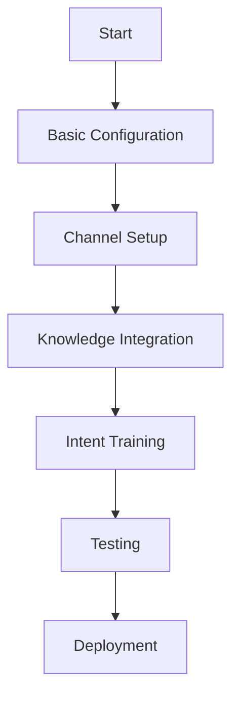

# Using the Bot

Learn how to set up and configure your AI-powered service bot to provide automated support and enhance user experience.

## Bot Overview

The AITSM Bot is an intelligent virtual assistant that handles user inquiries, automates tasks, and provides seamless support experiences.

_Suggested Image: "bot-architecture.png" - High-level architecture diagram of the bot system_

## Initial Bot Setup

### 1. Bot Configuration

_Suggested Image: "bot-setup-wizard.png" - Screenshot of the bot setup wizard_

### 2. Channel Configuration

Configure the channels where your bot will be available:
- Web widget
- Microsoft Teams
- Slack
- Email
- WhatsApp

_Suggested Image: "channel-config.png" - Screenshot of channel configuration page_

## Bot Capabilities

### 1. Natural Language Understanding
- Intent recognition
- Entity extraction
- Context management
- Multi-language support

_Suggested Image: "nlu-dashboard.png" - Screenshot of NLU analytics dashboard_

### 2. Knowledge Integration
The bot seamlessly integrates with your [Knowledge Base](knowledge-base) to provide accurate responses.

### 3. Ticket Management
- Create tickets
- Check status
- Update information
- Escalate to agents

_Suggested Image: "ticket-flow.png" - Flowchart of ticket management process_

## AI Agents Integration

The bot leverages multiple AI agents:
- [Intent Action Agent](../ai-features/bot-agents#intent-action-agent)
- [Strategy Response Agent](../ai-features/bot-agents#strategy-response-agent)
- [Knowledge Result Agent](../ai-features/bot-agents#knowledge-result-agent)

## Performance Monitoring

### Analytics Dashboard
Monitor your bot's performance through:
- Resolution rate
- User satisfaction
- Response accuracy
- Handover rate

_Suggested Image: "bot-analytics.png" - Screenshot of bot analytics dashboard_

## Best Practices

1. Regular intent training
2. Response optimization
3. Fallback handling
4. Continuous monitoring

## Next Steps

After setting up your bot:
- [Enable Ticket Types](ticket-types)
- [Configure Service Portal](service-portal)
- [Monitor Bot Efficiency](bot-efficiency)

## Related Topics
- [Bot Agents](../ai-features/bot-agents)
- [Bot Channels](../integrations/bot-channels)
- [Bot Architecture](../core-concepts/bot)
