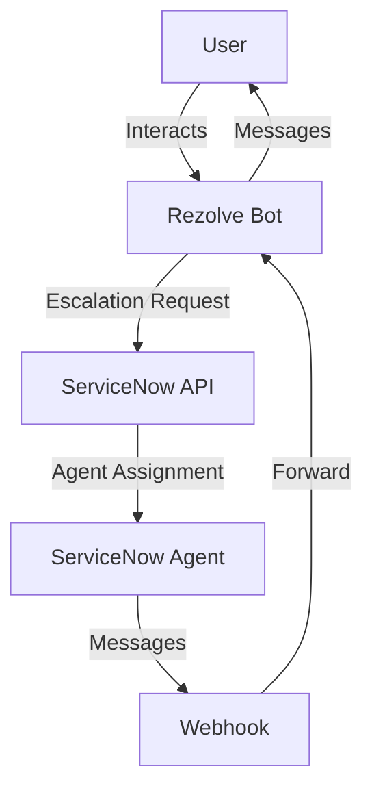
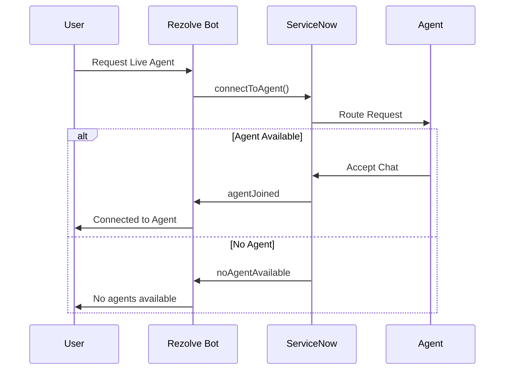
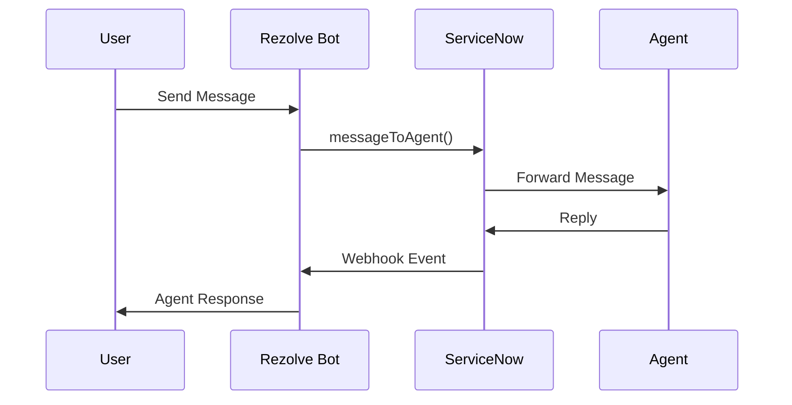
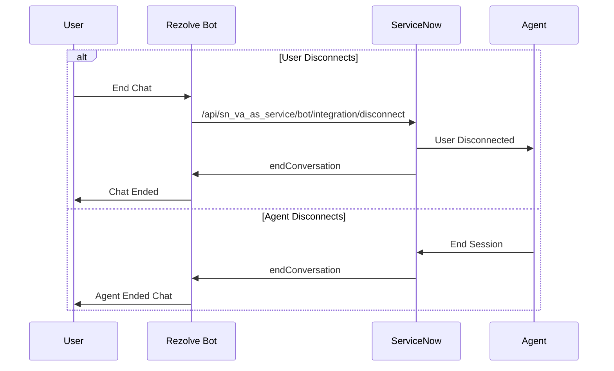
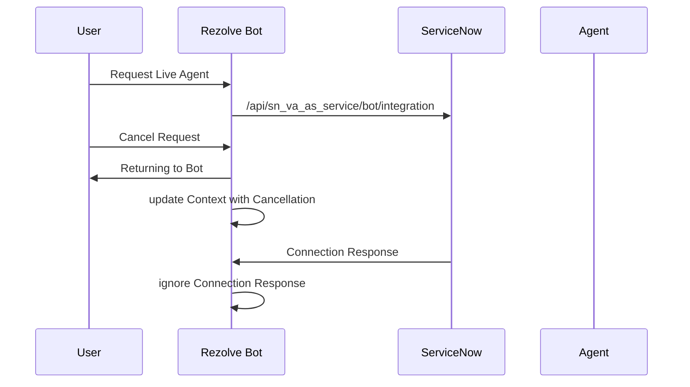
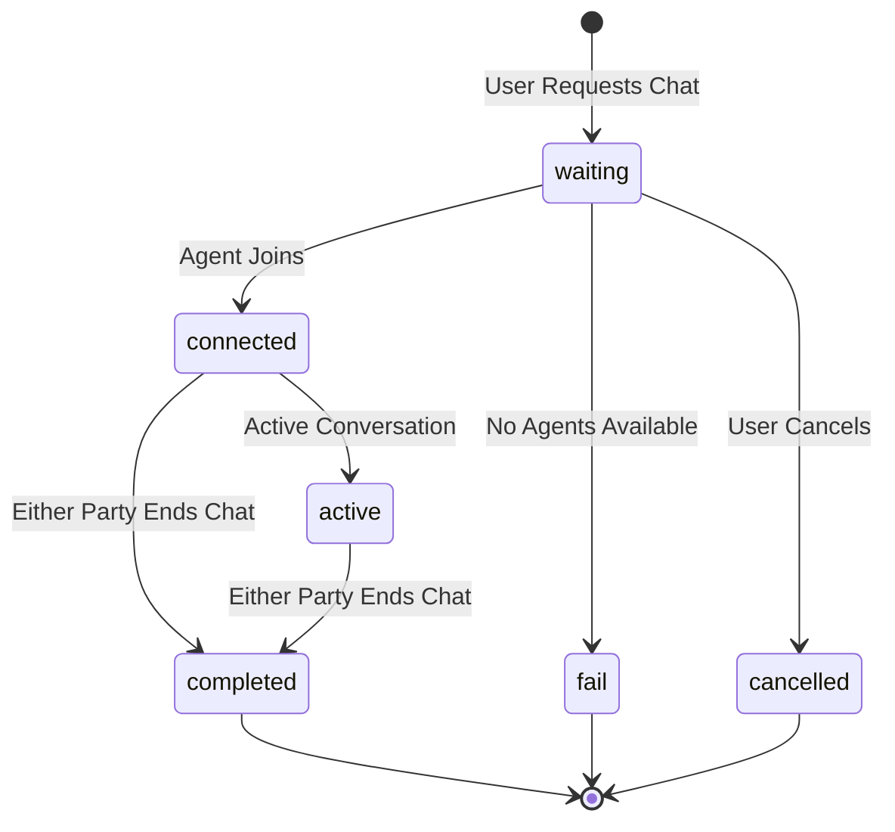

# ServiceNow LiveChat Integration Technical Specification

## Table of Contents
- [Overview](#overview)
- [Architecture](#architecture)
- [Components](#key-components)
- [Integration Flow](#integration-flow)
- [API Specifications](#api-specifications)
- [Security](#security)
- [Error Handling](#error-handling)
- [Configuration](#configuration)

## Overview

The ServiceNow LiveChat integration enables seamless handoff between automated bot conversations and human agents. This document outlines the technical implementation details, architecture, and workflows.

## Architecture



### Key Components
1. **Bot Framework Middleware** - Handles message routing and session management
2. **ServiceNow API Client** - Manages API communication with ServiceNow
3. **Webhook Handler** - Processes incoming events from ServiceNow
4. **Session Controller** - Maintains chat state and context

## Integration Flow

### 1. Escalation Flow



### 2. Message Flow



### 3. Disconnection Flow



### 4. Cancellation Flow



## API Specifications

### Authentication

1. **Token Generation**
```typescript
POST /oauth_token.do
Content-Type: application/x-www-form-urlencoded
{
    grant_type: "password",
    client_id: string,
    client_secret: string,
    username: string,
    password: string
}

Response:
{
    "access_token": string,
    "refresh_token": string,
    "expires_in": number,
    "token_type": "Bearer"
}
```

### ServiceNow API Endpoints

1. **Connect to Agent**
```typescript
POST /api/sn_va_as_service/bot/integration
Authorization: Bearer <token>
{
  "requestId": "string",
  
  "action": "AGENT",
  "token": "1234",
  "clientSessionId": string,
  "silentMessage": false,
  "nowBotId": "A85PWLERF",
  "message": {
    "text": "Live Agent Support.",
    "typed": true,
    "clientMessageId": "ABC-123"
  },
  "contextVariables": {
    "request_on_behalf_of": "username@contoso.com",
    "request_topic":"Pay"
  },
  "userId": "username@contoso.com",
  "emailId": "username@contoso.com"
}

```

### Webhook Configuration

ServiceNow needs to be configured to send events to our webhook endpoint. This enables real-time communication for agent messages, status updates, and session management.

1. **Webhook Endpoint**
```typescript
POST /api/v1/snowBot/receiveMessage
Content-Type: application/json
Authorization: Bearer <bot_password>

Request Parameters:
{
    clientSessionId: string,  // Unique session identifier from ServiceNow
    requestId: string,        // Unique identifier for the chat request
    userId: string,          // User identifier
    status: string,          // Current status of the chat session
    error_message?: string,  // Error message if any
    completed?: boolean,     // Indicates if the chat session is completed
    agentChat?: boolean,     // Indicates if agent is actively chatting
    takeControl?: boolean,   // Indicates if agent is taking control of conversation
    clientVariables?: {      // Variables from ServiceNow
        [key: string]: any,
        tenantId: string,
        botId: string, 
        conversationId: string
    },
    body: Array<{           // Array of message activities
        uiType: string,     // Type of message
        message?: string,   // Text message content
        value?: string,     // Value for images or other content types
        agentInfo?: {       // Agent information
            agentName: string
        },
        actionType?: string,// Type of action for ActionMsg
        options?: array     // Options for Picker type messages
    }>
}

Response:
200 OK - Successfully posted into conversation
400 Bad Request - If requestId or botId is invalid
500 Server Error - For processing errors
```

2. **Common Status Values**
```typescript
status: {
    'active',      // Chat session is active
    'waiting',     // Waiting for agent
    'connected',   // Connected to agent
    'completed',   // Chat session completed
    'fail',        // Chat session failed
    'cancelled'    // Chat request cancelled
}
```

3. **State Transitions**



4. **Special Cases**

a. **Agent Taking Control**
```json
{
    "status": "connected",
    "takeControl": true,
    "agentChat": true,
    "body": [{
        "uiType": "ActionMsg",
        "actionType": "AgentControl",
        "message": "Agent has taken control of the conversation"
    }]
}
```

b. **Session Completion**
```json
{
    "status": "completed",
    "completed": true,
    "body": [{
        "uiType": "ActionMsg",
        "actionType": "EndConversation",
        "message": "The conversation has ended"
    }]
}
```

c. **Error Handling**
```json
{
    "status": "fail",
    "error_message": "No agents are available to chat",
    "body": [{
        "uiType": "OutputText",
        "message": "We're sorry, but all agents are currently busy. Please try again later."
    }]
}
```

## Security

1. **Authentication**
   - OAuth 2.0 token-based authentication
   - Encrypted credentials storage
   - Token refresh mechanism

2. **Data Protection**
   - End-to-end encryption for messages
   - Secure file transfer

## Error Handling

1. **Connection Errors**
   - Automatic retry with exponential backoff
   - Fallback to bot conversation
   - User notification

2. **Session Management**
   - Timeout handling
   - Reconnection logic
   - Session state preservation

## Configuration

### Required Environment Variables
```bash
SERVICENOW_CLIENT_ID=<client_id>
SERVICENOW_CLIENT_SECRET=<client_secret>
SERVICENOW_USERNAME=<username>
SERVICENOW_PASSWORD=<password>
SERVICENOW_INSTANCE=<instance_url>
WEBHOOK_SECRET=<webhook_secret>
