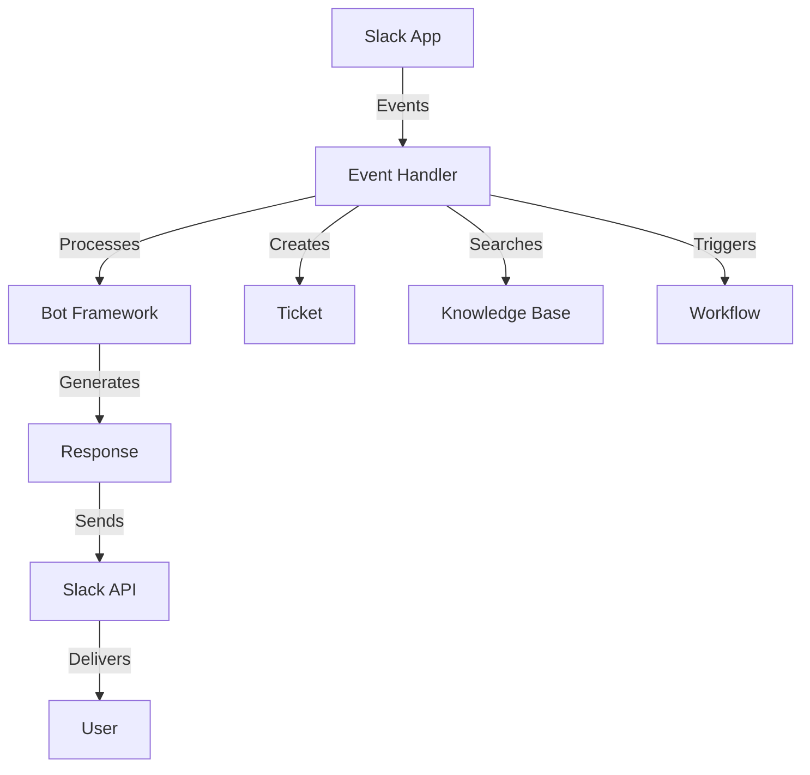
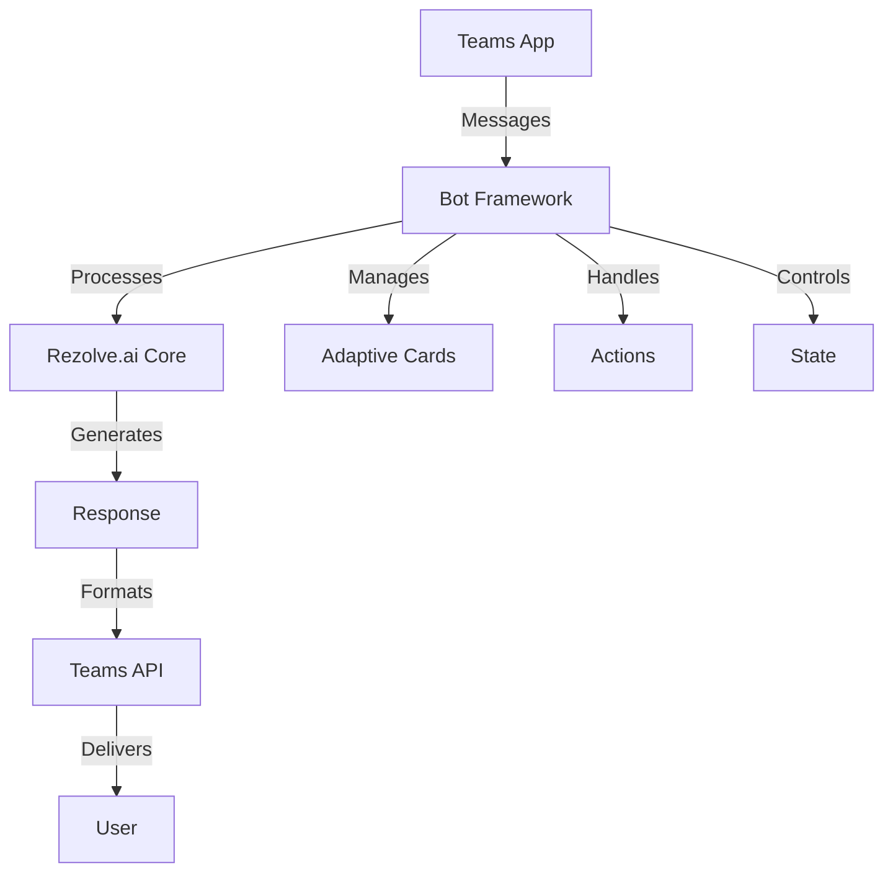
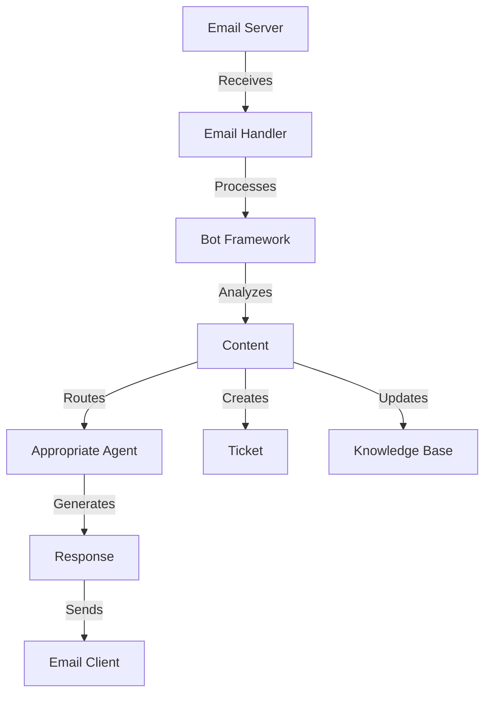
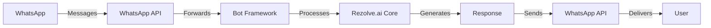
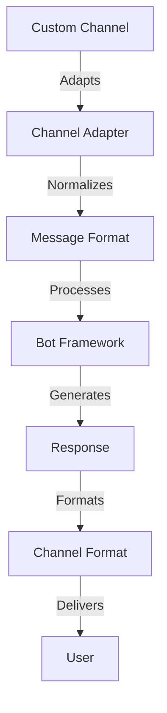

# Bot Channel Integrations

Learn how to integrate Rezolve.ai's AI-powered bot with various communication channels.

## Overview

Rezolve.ai supports multiple communication channels to provide seamless AI assistance across your organization's preferred platforms.

_Suggested Image: "bot-channels-overview.png" - Overview of supported channels_

## Slack Integration

### Architecture Overview

### Setup Process
1. Create Slack App
   - App configuration
   - Permission scopes
   - Event subscriptions
   - Bot token handling

2. Configure Webhooks
   - Endpoint setup
   - Event routing
   - Security settings

_Suggested Image: "slack-setup.png" - Slack app configuration steps_

### Features
- Interactive messages
- Thread management
- File handling
- User mentions
- Rich formatting

## Microsoft Teams Integration

### Architecture Overview

### Setup Process
1. Register Teams App
   - App manifest
   - Bot registration
   - Permission config
   - SSO setup

2. Configure Endpoints
   - Webhook setup
   - Authentication
   - Message routing

_Suggested Image: "teams-setup.png" - Teams integration setup_

### Features
- Adaptive cards
- Message extensions
- Tab applications
- Meeting integration
- File sharing

## Email Integration

### Architecture Overview

### Setup Process
1. Email Server Configuration
   - SMTP/IMAP setup
   - Domain verification
   - Routing rules
   - Filter configuration

2. Bot Integration
   - Email parsing
   - Template management
   - Response handling

_Suggested Image: "email-setup.png" - Email integration configuration_

### Features
- Thread management
- Attachment handling
- Template responses
- Signature management
- Distribution lists

## WhatsApp Integration

### Architecture Overview

### Setup Process
1. WhatsApp Business API
   - Account setup
   - API configuration
   - Webhook setup
   - Message templates

2. Bot Integration
   - Message handling
   - Template management
   - Media processing

_Suggested Image: "whatsapp-setup.png" - WhatsApp integration steps_

### Features
- Rich messages
- Media sharing
- Quick replies
- Location sharing
- Contact sharing

## Custom Channel Integration

### Framework Overview

### Implementation Steps
1. Channel Adapter
   - Message formatting
   - Event handling
   - State management
   - Error handling

2. Integration Setup
   - Authentication
   - Endpoint configuration
   - Message routing
   - Response handling

_Suggested Image: "custom-integration.png" - Custom integration framework_

## Security Considerations

### Authentication
- OAuth 2.0
- API tokens
- JWT handling
- Session management

### Data Protection
- Encryption
- Data masking
- Access control
- Audit logging

_Suggested Image: "security-measures.png" - Security implementation_

## Performance Optimization

### Message Handling
- Queue management
- Rate limiting
- Caching strategies
- Load balancing

### Resource Management
- Connection pooling
- Thread management
- Memory optimization
- Error recovery

_Suggested Image: "performance-metrics.png" - Performance dashboard_

## Best Practices

### Integration Design
- Modular architecture
- Error handling
- Logging strategy
- Testing approach

### Maintenance
- Monitoring setup
- Update management
- Backup procedures
- Recovery plans

_Suggested Image: "best-practices.png" - Best practices checklist_

## Troubleshooting

### Common Issues
1. Connection Problems
   - Authentication errors
   - Network issues
   - API limits
   - Format errors

2. Performance Issues
   - Response delays
   - Resource constraints
   - Queue bottlenecks
   - Memory leaks

_Suggested Image: "troubleshooting-guide.png" - Troubleshooting flowchart_

## Related Topics
- [Custom Agents](../ai-features/custom-agents)
- [System Integration](../core-concepts/integrations)
- [Bot Architecture](../core-concepts/bot)

