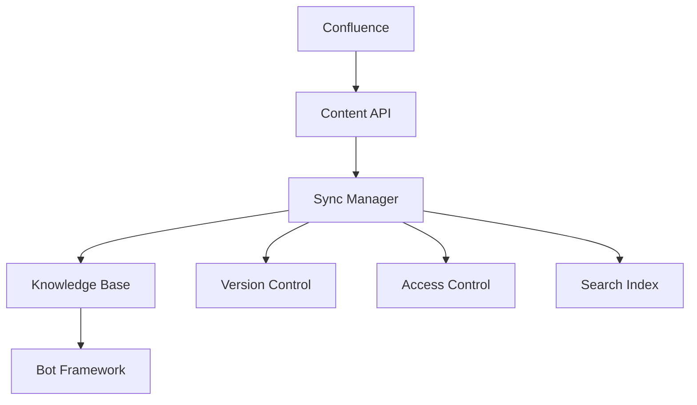
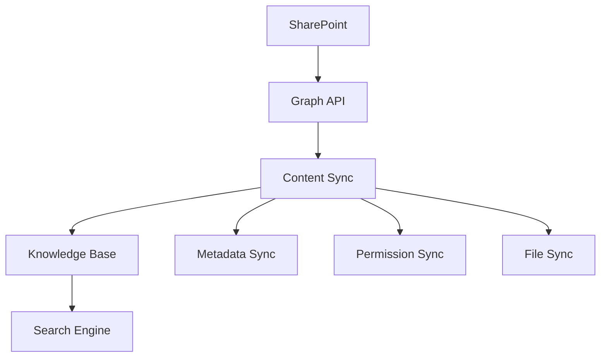
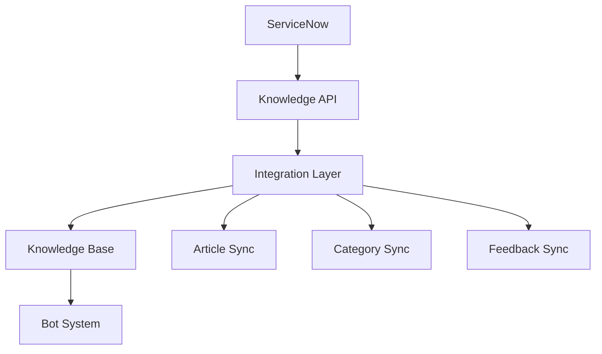
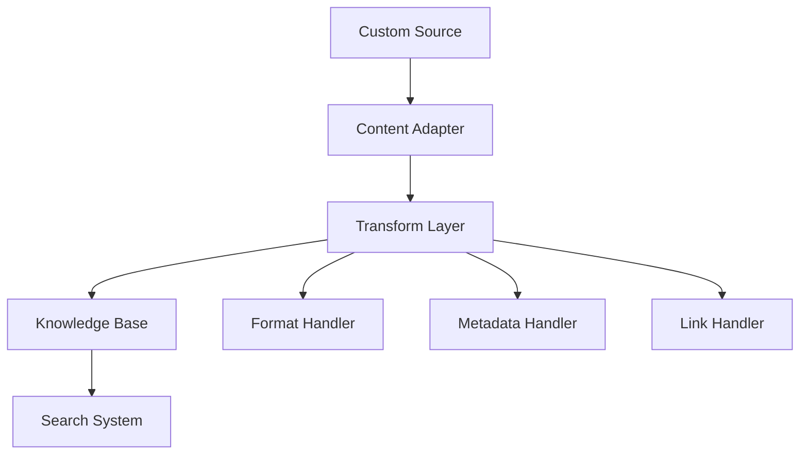

# Knowledge Base Integrations

Learn how to integrate Rezolve.ai's knowledge management system with various external knowledge sources.

## Overview

Rezolve.ai provides robust integration capabilities with popular knowledge management systems and documentation platforms.

_Suggested Image: "knowledge-integrations-overview.png" - Overview of supported integrations_

## Confluence Integration

### Architecture Overview

### Setup Process
1. Configure Confluence
   - API credentials
   - Space selection
   - Page filtering
   - Permission mapping

2. Setup Sync
   - Content mapping
   - Update frequency
   - Conflict resolution
   - Version tracking

_Suggested Image: "confluence-setup.png" - Confluence integration setup_

### Features
- Bi-directional sync
- Rich content support
- Version control
- Permission mapping
- Search integration

## SharePoint Integration

### Architecture Overview

### Setup Process
1. SharePoint Configuration
   - OAuth setup
   - Site selection
   - Library mapping
   - Permission config

2. Content Management
   - Structure mapping
   - Metadata sync
   - File handling
   - Update tracking

_Suggested Image: "sharepoint-setup.png" - SharePoint integration configuration_

### Features
- Document sync
- Metadata mapping
- Permission sync
- Version history
- Search integration

## ServiceNow Integration

### Architecture Overview

### Setup Process
1. ServiceNow Setup
   - API access
   - Knowledge base mapping
   - Category alignment
   - User mapping

2. Sync Configuration
   - Content rules
   - Update triggers
   - Feedback flow
   - Analytics sync

_Suggested Image: "servicenow-setup.png" - ServiceNow integration setup_

### Features
- Article sync
- Category mapping
- Feedback loop
- Usage analytics
- Search integration

## Custom Source Integration

### Framework Overview

### Implementation Steps
1. Source Adapter
   - Content extraction
   - Format handling
   - Metadata mapping
   - Link management

2. Integration Setup
   - Content rules
   - Update flow
   - Error handling
   - Monitoring

_Suggested Image: "custom-integration.png" - Custom integration framework_

## Security Considerations

### Authentication
- OAuth 2.0
- API tokens
- SSO integration
- Role mapping

### Data Protection
- Content encryption
- Access control
- Audit logging
- Data masking

_Suggested Image: "security-measures.png" - Security implementation_

## Performance Optimization

### Content Sync
- Incremental updates
- Batch processing
- Delta sync
- Cache management

### Resource Management
- Connection pooling
- Rate limiting
- Load balancing
- Error recovery

_Suggested Image: "performance-metrics.png" - Performance dashboard_

## Best Practices

### Integration Design
- Content structure
- Update strategy
- Error handling
- Monitoring plan

### Maintenance
- Regular sync
- Content validation
- Link verification
- Permission audit

_Suggested Image: "best-practices.png" - Best practices checklist_

## Troubleshooting

### Common Issues
1. Sync Problems
   - Connection errors
   - Permission issues
   - Content conflicts
   - Format problems

2. Performance Issues
   - Slow sync
   - Resource constraints
   - API limits
   - Search delays

_Suggested Image: "troubleshooting-guide.png" - Troubleshooting flowchart_

## Related Topics
- [Knowledge Agents](../ai-features/knowledge-agents)
- [Bot Integration](bot-channels)
- [System Integration](../core-concepts/integrations)

