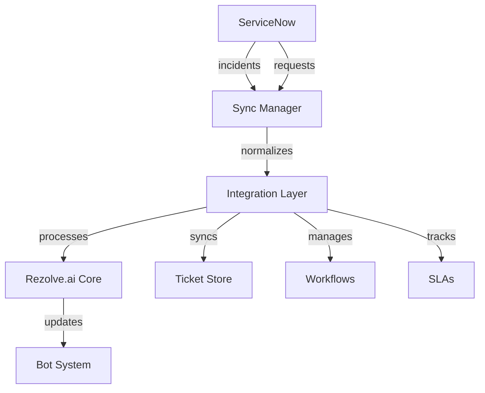
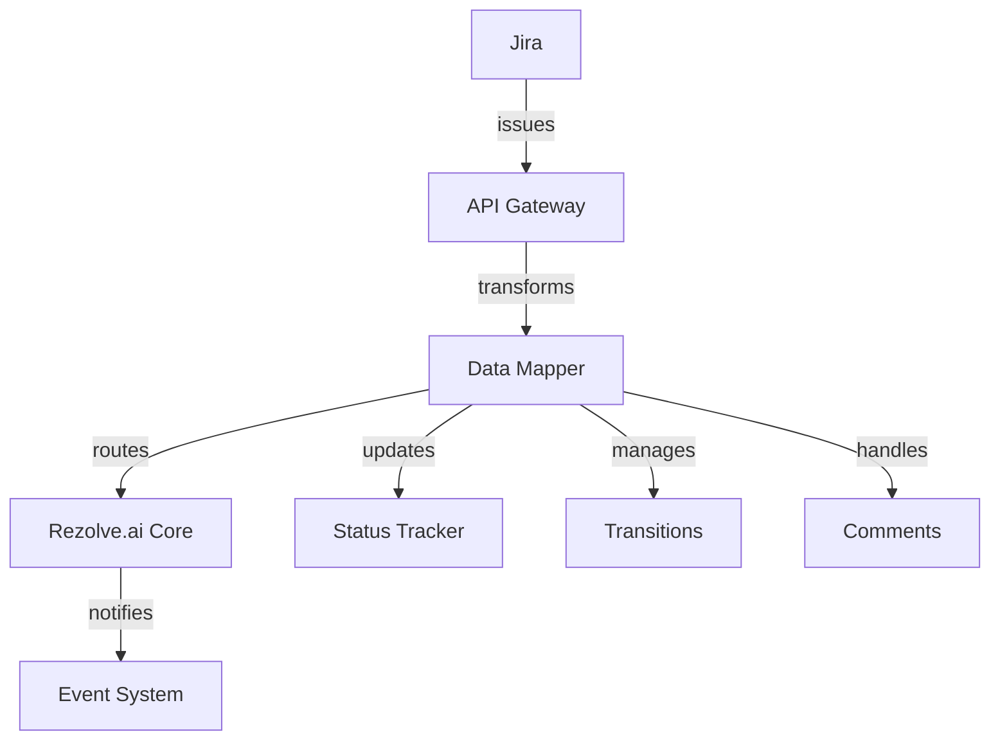
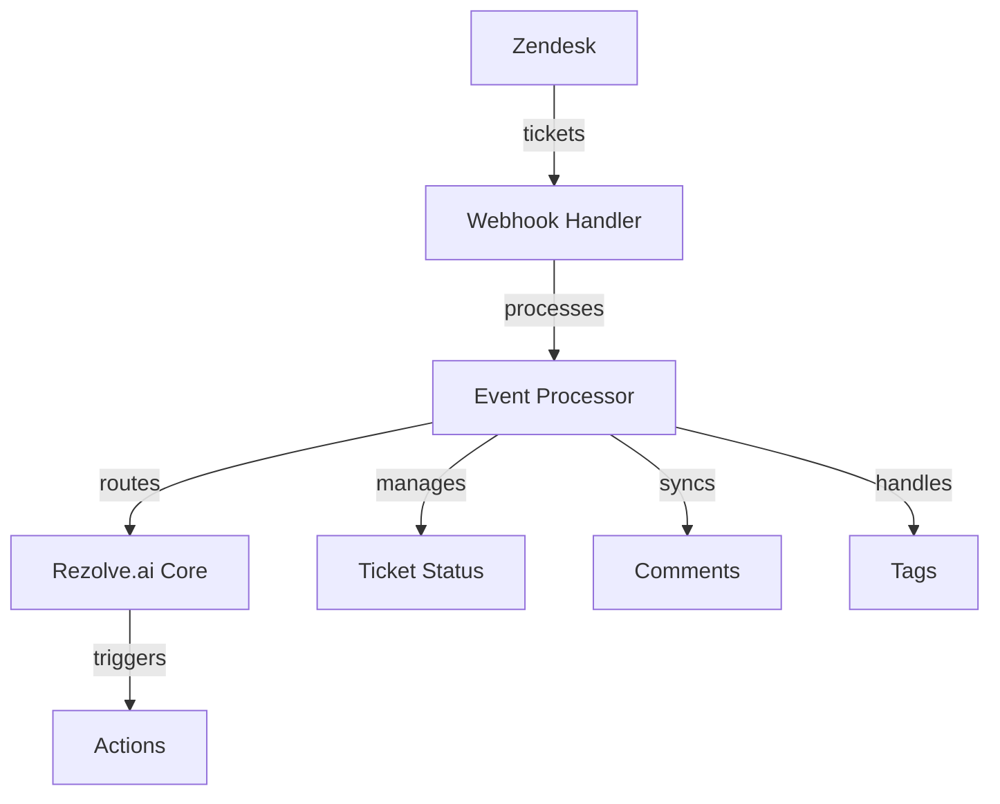
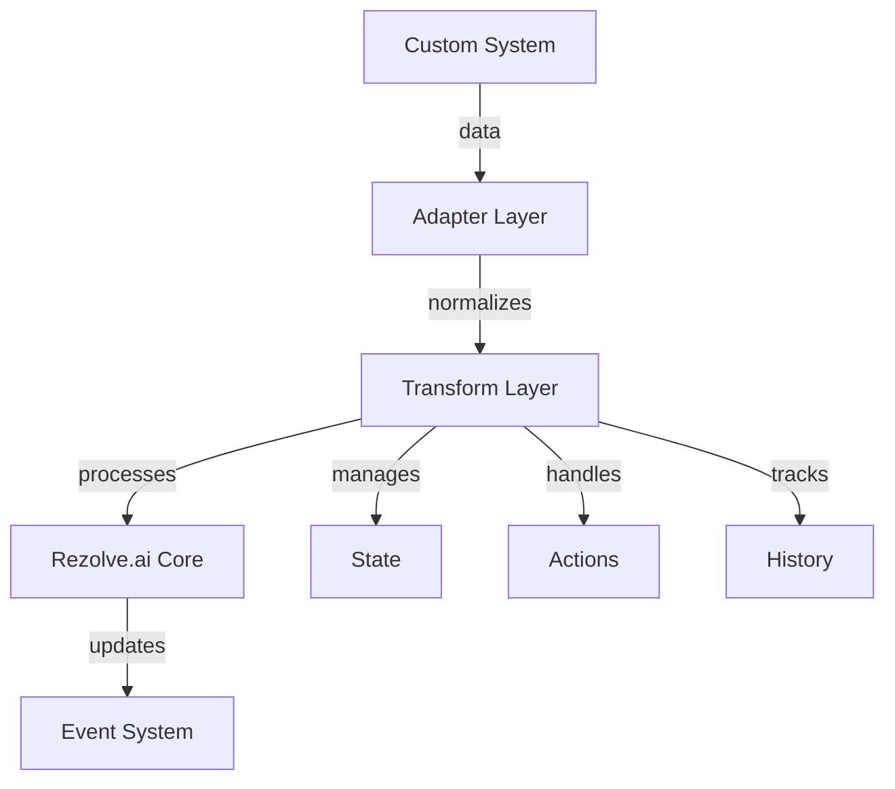

# Ticketing Systems Integration

Learn how to integrate Rezolve.ai with various ticketing and service management platforms.

## Overview

Rezolve.ai provides seamless integration with popular ticketing systems to enable unified service management.

_Suggested Image: "ticketing-integrations-overview.png" - Overview of supported ticketing systems_

## ServiceNow Integration

### Architecture Overview

### Setup Process
1. ServiceNow Configuration
   - Instance setup
   - API credentials
   - Field mapping
   - Workflow alignment

2. Integration Setup
   - Sync rules
   - Update triggers
   - SLA configuration
   - User mapping

_Suggested Image: "servicenow-setup.png" - ServiceNow integration setup_

### Features
- Bi-directional sync
- Field mapping
- Workflow integration
- SLA management
- Attachment handling

## Jira Service Management

### Architecture Overview

### Setup Process
1. Jira Configuration
   - Project setup
   - API tokens
   - Workflow mapping
   - Custom fields

2. Integration Setup
   - Field mapping
   - Status sync
   - Comment flow
   - Attachment handling

_Suggested Image: "jira-setup.png" - Jira integration configuration_

### Features
- Issue sync
- Comment threading
- Status mapping
- Custom fields
- Attachment sync

## Zendesk Integration

### Architecture Overview

### Setup Process
1. Zendesk Setup
   - API configuration
   - Webhook setup
   - Field mapping
   - Tag management

2. Integration Config
   - Ticket mapping
   - Status flow
   - Comment sync
   - User matching

_Suggested Image: "zendesk-setup.png" - Zendesk integration setup_

### Features
- Ticket sync
- Comment threading
- Tag management
- Custom fields
- Macro support

## Custom Ticketing Integration

### Framework Overview

### Implementation Steps
1. Adapter Development
   - Data mapping
   - Event handling
   - State management
   - Action routing

2. Integration Setup
   - Field mapping
   - Workflow config
   - Error handling
   - Monitoring

_Suggested Image: "custom-integration.png" - Custom integration framework_

## Security Considerations

### Authentication
- OAuth 2.0
- API tokens
- SSO integration
- Role mapping

### Data Protection
- Encryption
- Access control
- Audit logging
- Data masking

_Suggested Image: "security-measures.png" - Security implementation_

## Performance Optimization

### Sync Management
- Batch processing
- Delta updates
- Queue management
- Cache strategy

### Resource Handling
- Connection pooling
- Rate limiting
- Load balancing
- Error recovery

_Suggested Image: "performance-metrics.png" - Performance dashboard_

## Best Practices

### Integration Design
- Field mapping
- Status flow
- Error handling
- Monitoring setup

### Maintenance
- Sync validation
- Performance monitoring
- Error tracking
- Update management

_Suggested Image: "best-practices.png" - Best practices checklist_

## Troubleshooting

### Common Issues
1. Sync Problems
   - Connection errors
   - Field mapping issues
   - Status conflicts
   - Update failures

2. Performance Issues
   - Sync delays
   - API limits
   - Resource constraints
   - Queue bottlenecks

_Suggested Image: "troubleshooting-guide.png" - Troubleshooting flowchart_

## Related Topics
- [Bot Integration](bot-channels)
- [Custom Agents](../ai-features/custom-agents)
