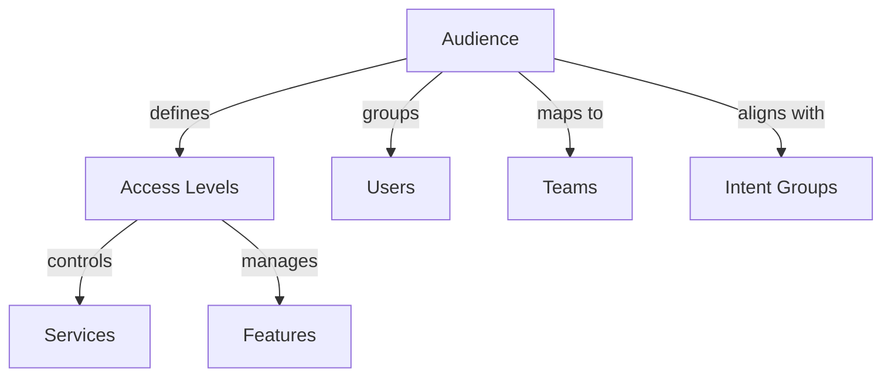

# Audience

Managing and configuring audience settings in the AITSM Service Portal.

## Overview

Audience configuration determines who can access specific services and features within the portal.

_Suggested Image: "audience-overview.png" - Audience management dashboard_

## Structure

## Components

### 1. Audience Types
- End users
- Service desk agents
- Knowledge workers
- Administrators
- Custom roles

### 2. Access Configuration
- Service access
- Feature visibility
- Content access
- Action permissions
- Integration access

_Suggested Image: "audience-configuration.png" - Access configuration_

## Best Practices

### 1. Setup Guidelines
- Role-based access
- Group management
- Permission mapping
- Access review
- Audit planning

### 2. Management
- Regular reviews
- Access updates
- Group maintenance
- Documentation
- Training

_Suggested Image: "audience-management.png" - Management dashboard_

## Related Topics
- [Teams](../security/teams)
- [Intent Groups](intent-groups)
- [Offers & Intent Groups](offers-intent-groups)
- [Integration](integration)
