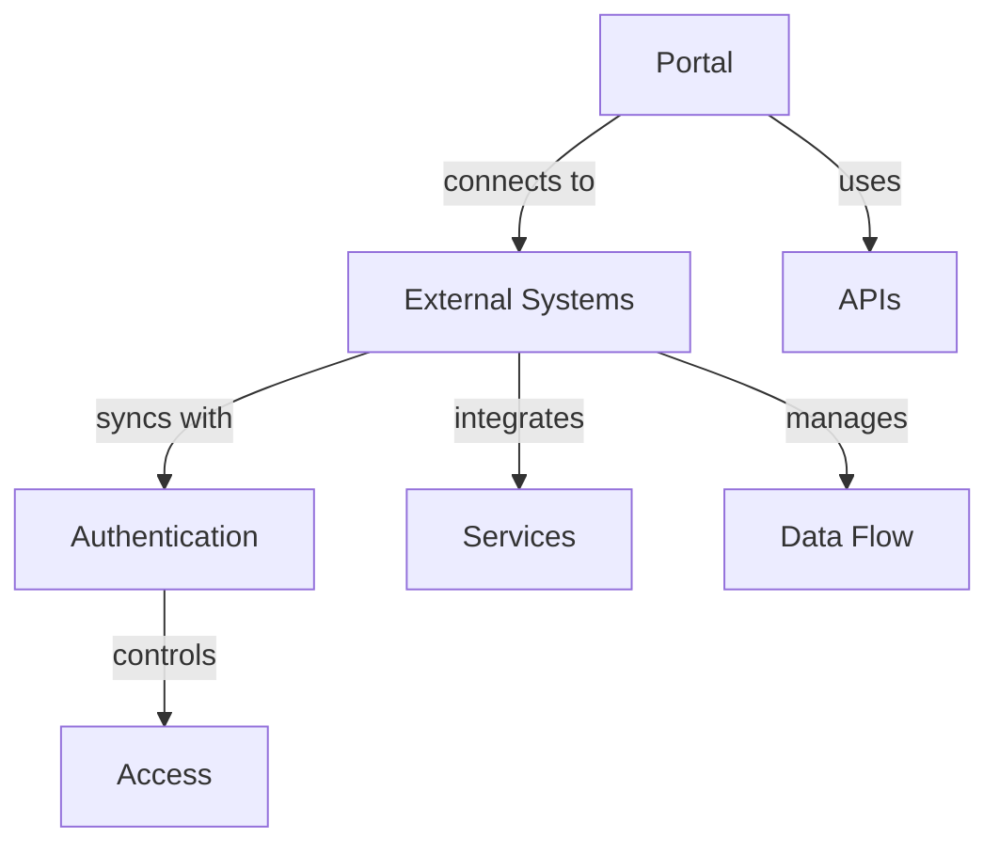

# Portal Integration

Learn how to integrate the Rezolve.ai Service Portal with other systems and services.

## Overview

Portal integration enables seamless connection with various enterprise systems and services.

_Suggested Image: "portal-integration-overview.png" - Integration architecture_

## Structure

## Components

### 1. Integration Types
- Authentication systems
- Directory services
- Service catalogs
- Knowledge bases
- Ticketing systems

### 2. Configuration
- API setup
- Authentication
- Data mapping
- Workflow integration
- Error handling

_Suggested Image: "integration-setup.png" - Configuration dashboard_

## Best Practices

### 1. Implementation Guidelines
- Security first
- Data validation
- Error handling
- Performance optimization
- Monitoring setup

### 2. Maintenance
- Regular testing
- Performance monitoring
- Error tracking
- Documentation
- Updates management

_Suggested Image: "integration-management.png" - Management dashboard_

## Related Topics
- [Intent Groups](intent-groups)
- [Audience](audience)
- [Bot Integration](../integrations/bot-channels)
- [System Integration](../core-concepts/integrations)
