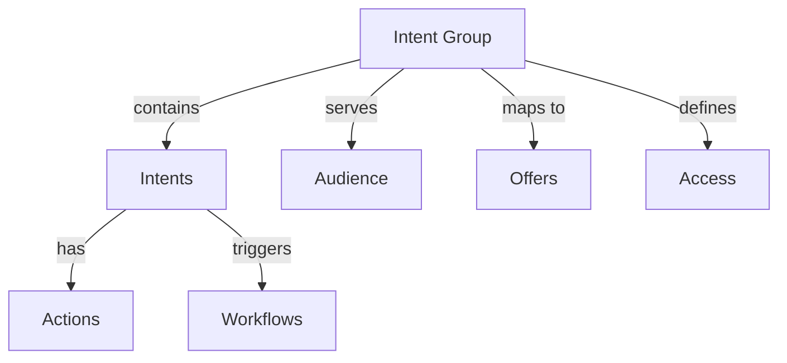

# Intent Groups

Understanding and managing intent groups in the Rezolve.ai Service Portal.

## Overview

Intent groups organize and categorize user intents for efficient service delivery and automation.

_Suggested Image: "intent-groups-overview.png" - Intent groups hierarchy_

## Structure

## Components

### 1. Intent Definition
- Intent patterns
- Variations
- Keywords
- Context mapping
- Action mapping

### 2. Group Organization
- Hierarchical structure
- Category mapping
- Service alignment
- Access control
- Version management

_Suggested Image: "intent-organization.png" - Intent group structure_

## Best Practices

### 1. Design Guidelines
- Clear categorization
- Logical grouping
- Intent coverage
- Action alignment
- Access planning

### 2. Implementation
- Testing strategy
- Version control
- Documentation
- Training material
- Monitoring plan

_Suggested Image: "intent-best-practices.png" - Design guidelines_

## Related Topics
- [Audience](audience)
- [Offers & Intent Groups](offers-intent-groups)
- [Integration](integration)
