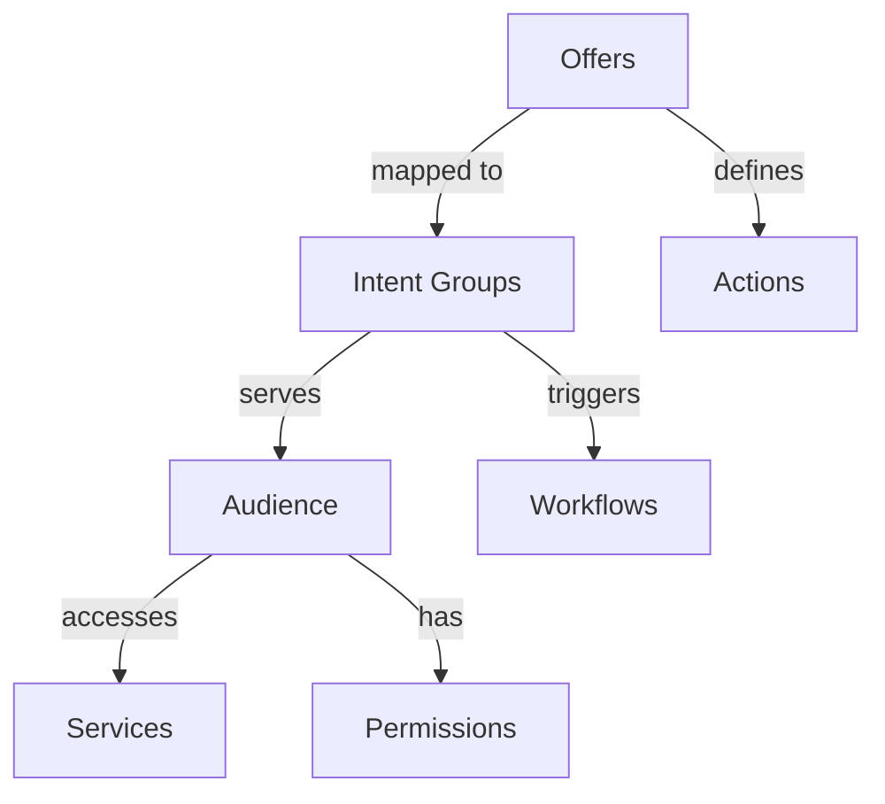

# Offers & Intent Groups

Understanding the relationship between offers and intent groups in AITSM.

## Overview

Offers and intent groups work together to provide targeted services to specific audiences.

_Suggested Image: "offers-intents-overview.png" - Offers and intents relationship_

## Structure

## Components

### 1. Offer Configuration
- Service offerings
- Action mapping
- Audience targeting
- Access control
- Version management

### 2. Intent Mapping
- Service alignment
- Action triggers
- Workflow integration
- Permission control
- Analytics setup

_Suggested Image: "offer-intent-mapping.png" - Configuration dashboard_

## Best Practices

### 1. Design Guidelines
- Clear structure
- Logical mapping
- Service coverage
- Access planning
- Analytics setup

### 2. Implementation
- Testing approach
- Version control
- Documentation
- Training material
- Monitoring setup

_Suggested Image: "offers-best-practices.png" - Implementation guide_

## Related Topics
- [Intent Groups](intent-groups)
- [Audience](audience)
- [Integration](integration)
- [Teams](../security/teams)
