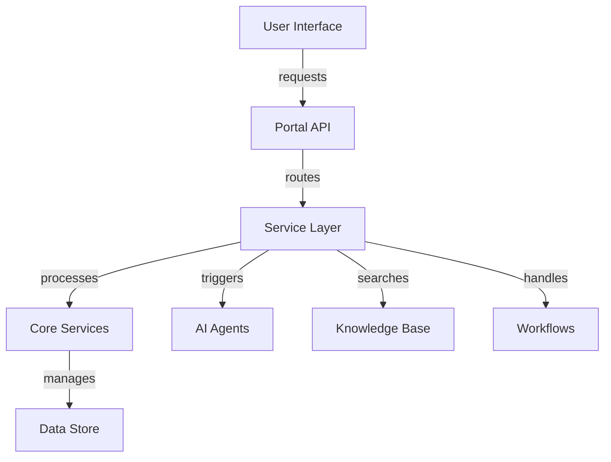
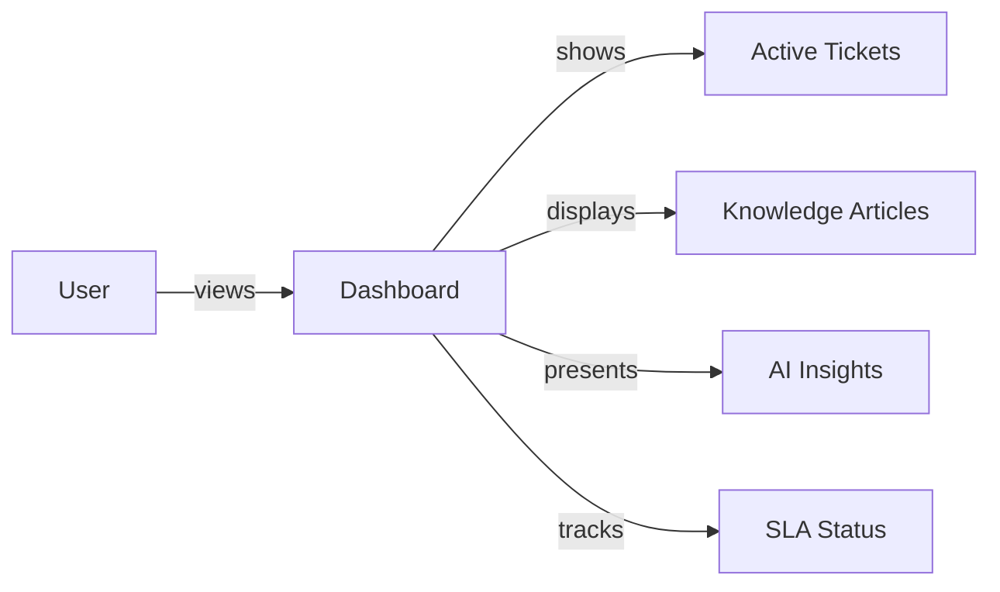
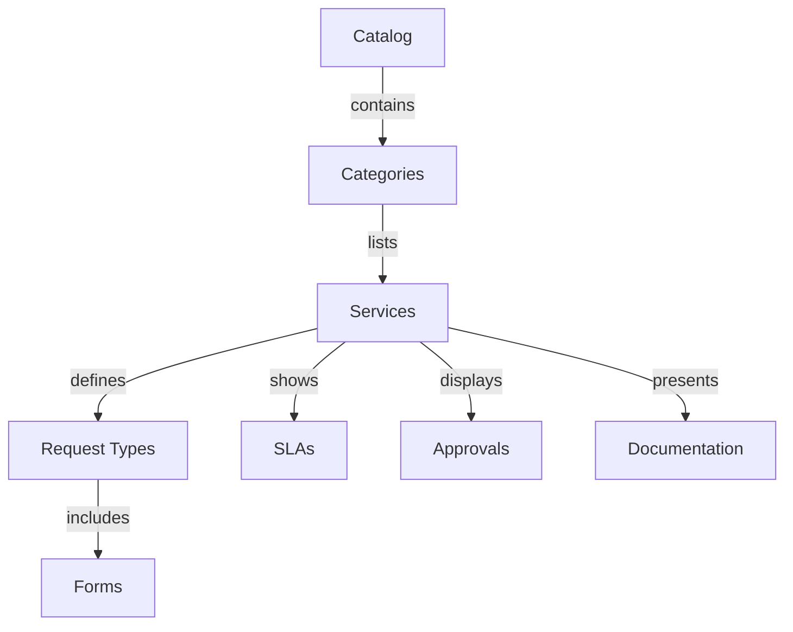

# Service Portal Overview

Learn about AITSM's modern, AI-powered service portal for end-users and service desk teams.

## Overview

The Service Portal provides a unified interface for service requests, knowledge access, and AI-assisted support.

_Suggested Image: "portal-overview.png" - Service Portal dashboard_

## Architecture

## Key Features

### 1. Smart Dashboard

Features:
- Personalized views
- AI-driven insights
- Real-time updates
- Performance metrics
- Action recommendations

### 2. Service Catalog

Components:
- Service categories
- Request templates
- Dynamic forms
- Workflow automation
- Knowledge integration

### 3. Knowledge Access

Features:
- Smart search
- Contextual suggestions
- Related articles
- Guided solutions
- Interactive content

_Suggested Image: "knowledge-access.png" - Knowledge interface_

## User Interface

### 1. Layout Components
- Navigation menu
- Search bar
- Quick actions
- Notification center
- User preferences

### 2. Responsive Design
- Mobile-first approach
- Adaptive layouts
- Touch optimization
- Offline capabilities

_Suggested Image: "responsive-design.png" - Multi-device layout_

## Customization

### 1. Theme Configuration
- Brand colors
- Logo placement
- Font selection
- Layout options
- Custom CSS

### 2. Component Customization
- Widget arrangement
- Dashboard layout
- Form design
- Report templates

_Suggested Image: "customization-options.png" - Theme editor_

## Integration Points

### 1. Authentication
- SSO support
- Multi-factor auth
- Role-based access
- Session management

### 2. External Systems
- Ticketing systems
- Knowledge bases
- Chat platforms
- Analytics tools

_Suggested Image: "integration-points.png" - System connections_

## Performance

### 1. Optimization
- Code splitting
- Lazy loading
- Cache management
- Asset optimization

### 2. Monitoring
- Usage analytics
- Error tracking
- Performance metrics
- User feedback

_Suggested Image: "performance-metrics.png" - Monitoring dashboard_

## Best Practices

### 1. Implementation
- Progressive enhancement
- Accessibility standards
- Security measures
- Testing strategy

### 2. Usage
- User training
- Content management
- Regular updates
- Feedback collection

_Suggested Image: "best-practices.png" - Implementation guide_

## Related Topics
- [Security & Access](../security/overview)
- [Use Cases](../use-cases/overview)
- [Bot Integration](../integrations/bot-channels)
- [Knowledge Management](../core-concepts/knowledge)
