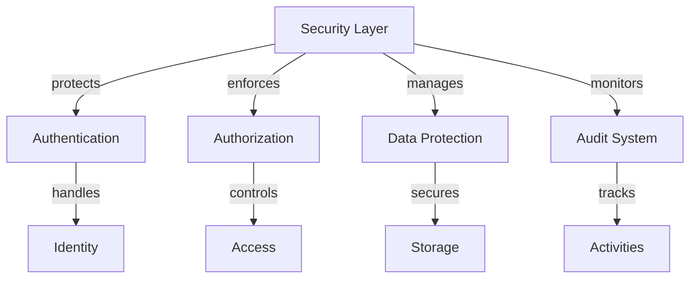
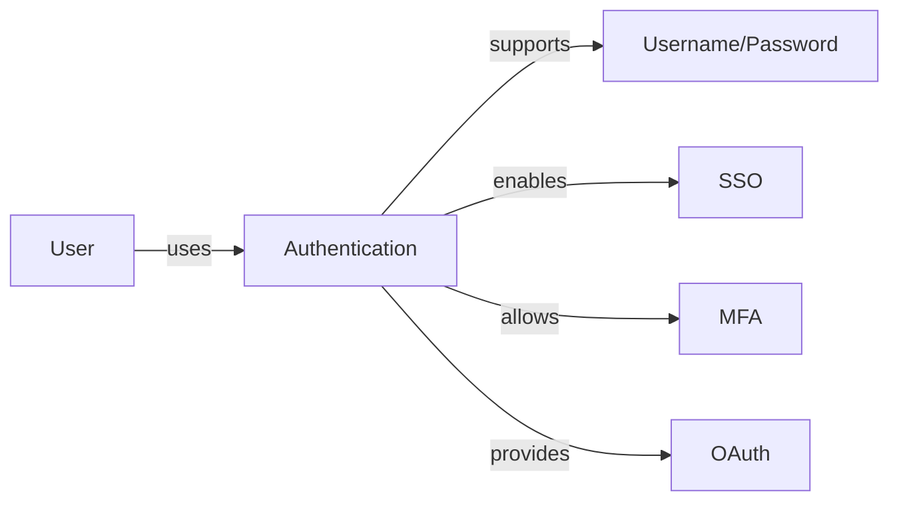
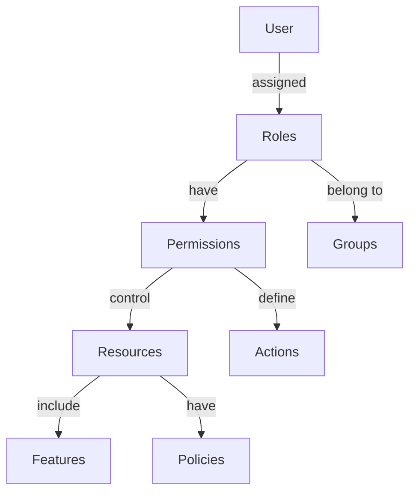
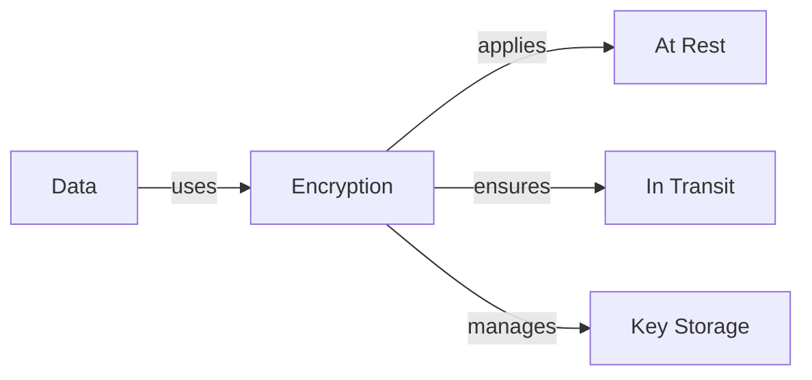
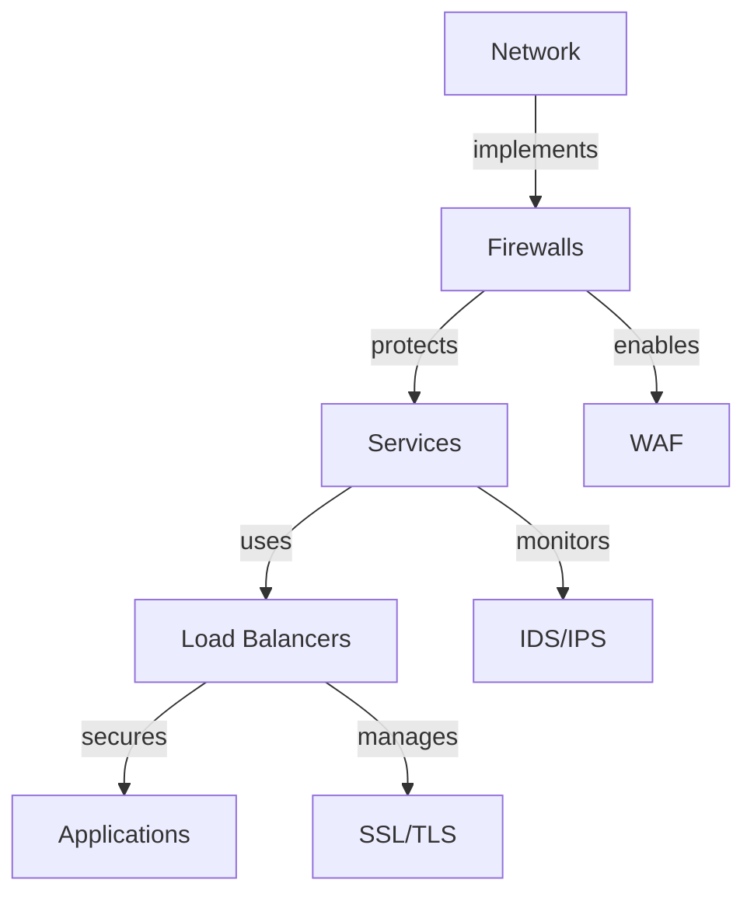

# Security & Access Control

Understanding Rezolve.ai's comprehensive security architecture and access control system.

## Overview

Rezolve.ai implements enterprise-grade security measures and fine-grained access control across all components.

_Suggested Image: "security-overview.png" - Security architecture_

## Security Architecture

## Authentication System

### 1. Authentication Methods

Features:
- Multi-factor authentication
- Single sign-on (SSO)
- Social authentication
- Biometric support
- Token management

### 2. Identity Management

Components:
- User provisioning
- Role assignment
- Group management
- Permission sets
- Access policies

_Suggested Image: "identity-management.png" - Identity dashboard_

## Access Control

### 1. Role-Based Access Control (RBAC)

Components:
- Role definitions
- Permission sets
- Resource policies
- Access levels
- Inheritance rules

### 2. Policy Management

Features:
- Policy creation
- Rule definition
- Condition setting
- Action control
- Override management

_Suggested Image: "policy-management.png" - Policy editor_

## Data Protection

### 1. Encryption

Features:
- Data-at-rest encryption
- TLS/SSL encryption
- Key management
- Certificate handling
- Secure storage

### 2. Data Privacy
- PII protection
- Data masking
- Retention policies
- Deletion procedures
- Compliance tools

_Suggested Image: "data-protection.png" - Encryption system_

## Compliance

### 1. Standards Compliance
- SOC 2
- GDPR
- HIPAA
- ISO 27001
- PCI DSS

### 2. Audit System
- Activity logging
- Access tracking
- Change monitoring
- Compliance reporting
- Alert management

_Suggested Image: "compliance-dashboard.png" - Compliance status_

## Network Security

### 1. Infrastructure Protection

Components:
- Firewall rules
- WAF policies
- DDoS protection
- Network isolation
- Traffic monitoring

### 2. API Security
- Authentication
- Rate limiting
- Input validation
- Output encoding
- Error handling

_Suggested Image: "network-security.png" - Security architecture_

## Incident Response

### 1. Security Monitoring
- Real-time alerts
- Threat detection
- Vulnerability scanning
- Log analysis
- Performance monitoring

### 2. Response Procedures
- Incident classification
- Response workflow
- Communication plan
- Recovery process
- Post-mortem analysis

_Suggested Image: "incident-response.png" - Response workflow_

## Best Practices

### 1. Implementation
- Security baseline
- Regular updates
- Penetration testing
- Security training
- Documentation

### 2. Maintenance
- Regular audits
- Policy reviews
- Access reviews
- Update management
- Training updates

_Suggested Image: "security-practices.png" - Best practices guide_

## Related Topics
- [Service Portal](../portal/overview)
- [Use Cases](../use-cases/overview)
- [System Integration](../core-concepts/integrations)
