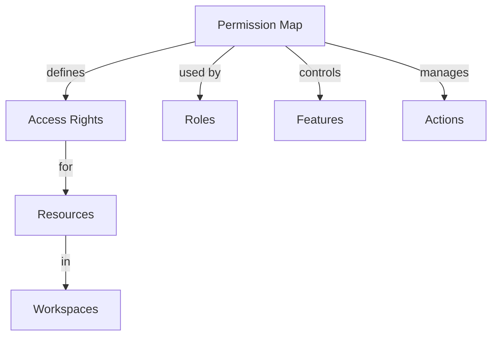

# Permission Map

Understanding the Rezolve.ai permission system and access control mapping.

## Overview

Permission maps define the relationship between roles, resources, and access levels.

_Suggested Image: "permission-map-overview.png" - Permission structure_

## Structure

## Components

### 1. Permission Types
- Read access
- Write access
- Delete rights
- Admin control
- Feature access

### 2. Resource Control
- Content access
- Feature control
- Action rights
- Integration permissions
- System settings

_Suggested Image: "permission-types.png" - Permission dashboard_

## Best Practices

### 1. Setup Guidelines
- Clear structure
- Access planning
- Permission mapping
- Documentation
- Training plan

### 2. Management
- Regular review
- Permission updates
- Access maintenance
- Documentation
- Training

_Suggested Image: "permission-management.png" - Management dashboard_

## Related Topics
- [Teams](teams)
- [Queues](queues)
- [Workspaces](workspaces)
- [Space Roles](space-roles)

