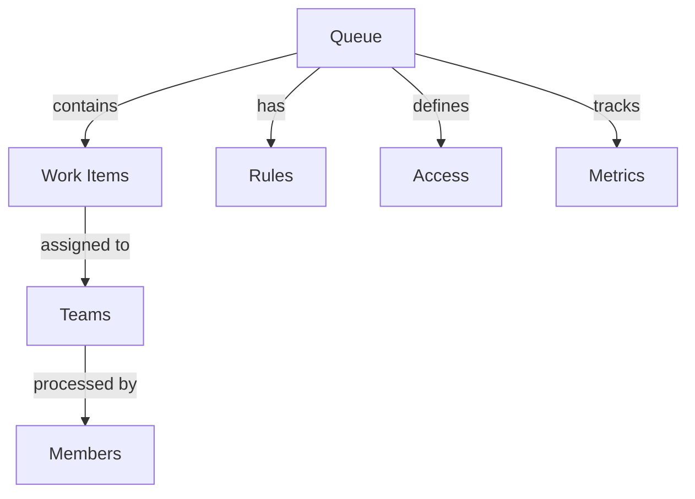

# Queues

Managing work distribution and access control through queues.

## Overview

Queues organize and distribute work items while controlling access to specific content.

_Suggested Image: "queues-overview.png" - Queue management dashboard_

## Structure

## Components

### 1. Queue Configuration
- Work distribution
- Team assignment
- Member access
- Rule setup
- Metric tracking

### 2. Queue Management
- Item routing
- Load balancing
- Priority handling
- SLA tracking
- Performance monitoring

_Suggested Image: "queue-configuration.png" - Setup dashboard_

## Best Practices

### 1. Setup Guidelines
- Clear structure
- Rule definition
- Access planning
- Monitoring setup
- Documentation

### 2. Operations
- Regular review
- Performance tracking
- Rule updates
- Documentation
- Training

_Suggested Image: "queue-operations.png" - Operations dashboard_

## Related Topics
- [Teams](teams)
- [Workspaces](workspaces)
- [Space Roles](space-roles)
- [Permission Map](permission-map)
