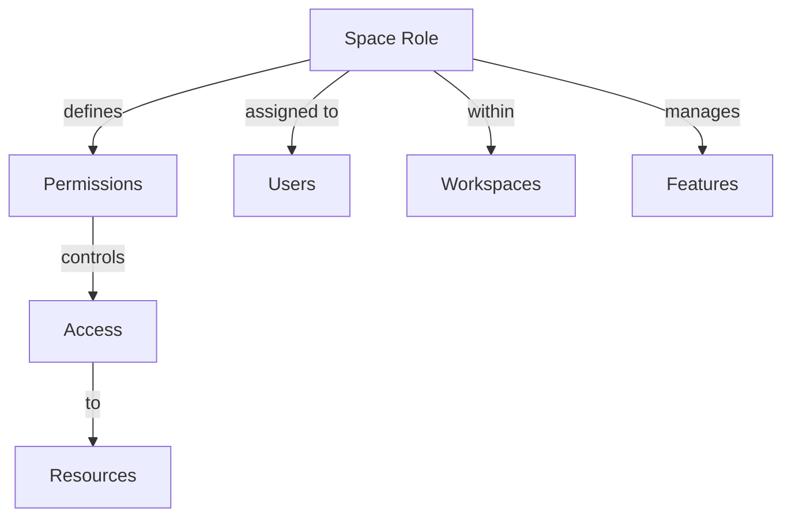

# Space Roles

Understanding and managing roles within Rezolve.ai spaces.

## Overview

Space roles define permissions and access levels within workspaces.

_Suggested Image: "space-roles-overview.png" - Role hierarchy_

## Structure

## Components

### 1. Role Configuration
- Permission sets
- Access levels
- Feature control
- Resource access
- Inheritance rules

### 2. Role Management
- Assignment rules
- Permission updates
- Access review
- Audit tracking
- Documentation

_Suggested Image: "role-configuration.png" - Setup dashboard_

## Best Practices

### 1. Setup Guidelines
- Clear structure
- Permission planning
- Access mapping
- Documentation
- Training plan

### 2. Administration
- Regular review
- Permission updates
- Role maintenance
- Documentation
- Training

_Suggested Image: "role-administration.png" - Management dashboard_

## Related Topics
- [Teams](teams)
- [Queues](queues)
- [Workspaces](workspaces)
- [Permission Map](permission-map)
