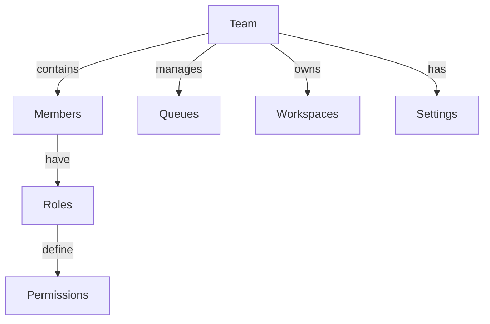

# Teams

Understanding team management and organization in AITSM.

## Overview

Teams are the fundamental organizational units that manage access and responsibilities.

_Suggested Image: "teams-overview.png" - Team structure overview_

## Structure

## Components

### 1. Team Configuration
- Member management
- Role assignment
- Permission setup
- Queue association
- Workspace access

### 2. Team Hierarchy
- Parent teams
- Sub teams
- Cross-team access
- Inheritance rules
- Access control

_Suggested Image: "team-hierarchy.png" - Team organization_

## Best Practices

### 1. Setup Guidelines
- Clear structure
- Role definition
- Access planning
- Documentation
- Training plan

### 2. Management
- Regular reviews
- Access updates
- Member maintenance
- Documentation
- Training

_Suggested Image: "team-management.png" - Management dashboard_

## Related Topics
- [Queues](queues)
- [Workspaces](workspaces)
- [Space Roles](space-roles)
- [Permission Map](permission-map)
