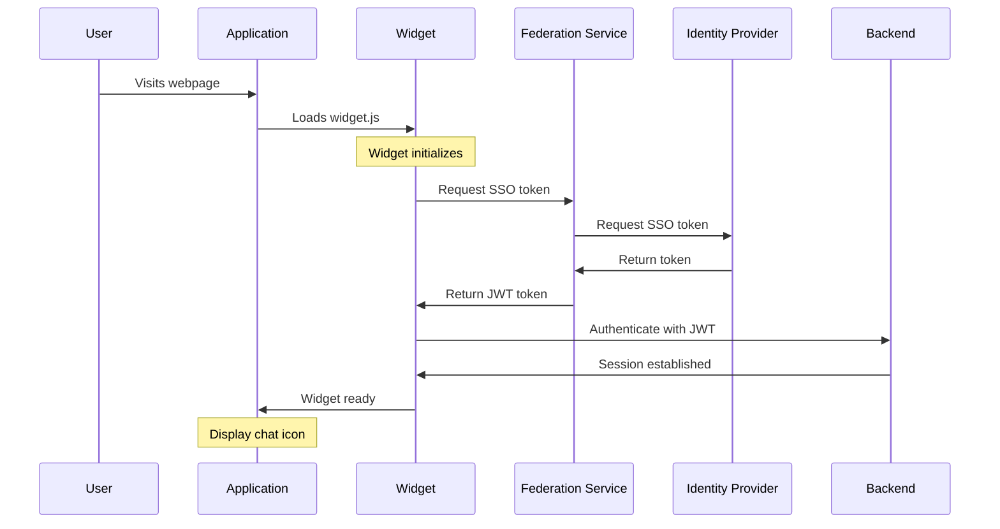

# SSO Implementation Guide for Widget Integration

## Overview

This technical guide explains the Single Sign-On (SSO) implementation for the embedded chat widget. The implementation uses a secure token-based approach to authenticate users seamlessly.

## Architecture



## Implementation Steps

### 1. Widget Integration

```html
<!-- Include the Widget Script -->
<link rel="stylesheet" type="text/css" href="https://cdn.virtualpeople.ai/style.css">
<script src="https://cdn.virtualpeople.ai/widget.js"></script>
```

### 2. Widget Initialization

```javascript
// realm identification and initialization in the federation service
window.EmbeddableWidget.mount("<realmname>");
```

### 3. SSO Configuration

The SSO implementation requires the following components:


1. Refer to the SSO configuration guide using SAML or Oauth for the realm


## Troubleshooting

Common issues and solutions:

1. **Widget Not Loading**:
   - Check CDN availability
   - Verify script inclusion
   - Check console for errors

2. **Authentication Failures**:
   - Refer to the troubleshooting guide for SSO configuration.


## Related Topics
- SSO Configuration Guide
