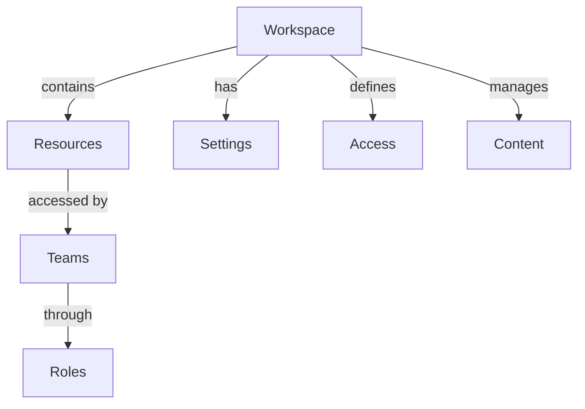

# Workspaces

Understanding and managing workspaces in Rezolve.ai.

## Overview

Workspaces provide isolated environments for different teams and projects.

_Suggested Image: "workspaces-overview.png" - Workspace structure_

## Structure

## Components

### 1. Workspace Configuration
- Resource management
- Team access
- Role setup
- Content organization
- Settings management

### 2. Access Control
- Team permissions
- Role assignment
- Content access
- Feature control
- Integration settings

_Suggested Image: "workspace-configuration.png" - Setup dashboard_

## Best Practices

### 1. Setup Guidelines
- Clear structure
- Access planning
- Content organization
- Integration setup
- Documentation

### 2. Management
- Regular review
- Access updates
- Content maintenance
- Documentation
- Training

_Suggested Image: "workspace-management.png" - Management dashboard_

## Related Topics
- [Teams](teams)
- [Queues](queues)
- [Space Roles](space-roles)
- [Permission Map](permission-map)
