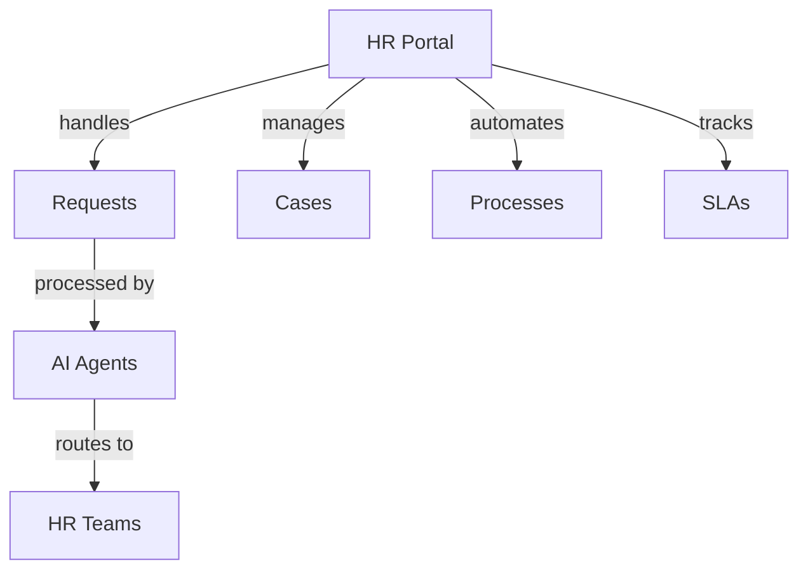

# HR Service Management

Rezolve.ai implementation for HR teams and employee support.

## Overview

AI-powered HR service management and employee support automation.

_Suggested Image: "hr-service-desk.png" - HR service management overview_

## Implementation

## Key Features

### 1. Employee Services
- Onboarding automation
- Leave management
- Benefits inquiries
- Document requests
- Training enrollment

### 2. Case Management
- AI triage
- Smart routing
- Knowledge integration
- Process automation
- Compliance tracking

_Suggested Image: "hr-processes.png" - Process flow_

## Success Metrics

### 1. Performance Indicators
- Response time
- Resolution rate
- Process compliance
- Employee satisfaction
- Team productivity

### 2. Business Impact
- Process efficiency
- Cost reduction
- Employee experience
- Compliance adherence
- Resource optimization

_Suggested Image: "hr-metrics.png" - Analytics dashboard_

## Related Topics
- [Bot Agents](../ai-features/bot-agents)
- [Knowledge Management](../core-concepts/knowledge)
- [Workflow Automation](../core-concepts/automation-workflows)
- [Integration](../portal/integration)
