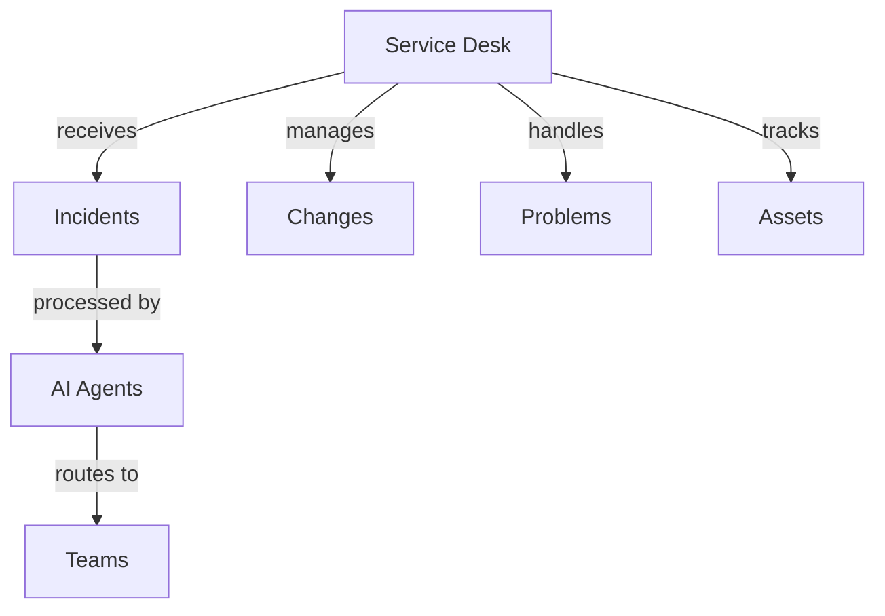

# IT Service Management

Rezolve.ai implementation for IT service desks and support teams.

## Overview

Comprehensive IT service management using Rezolve.ai's AI-powered features.

_Suggested Image: "it-service-desk.png" - IT service management overview_

## Implementation

## Key Features

### 1. Incident Management
- AI triage
- Smart routing
- Knowledge integration
- SLA tracking
- Resolution automation

### 2. Change Management
- Workflow automation
- Impact analysis
- Approval routing
- Implementation tracking
- Risk assessment

_Suggested Image: "incident-management.png" - Process flow_

## Success Metrics

### 1. Performance Indicators
- Resolution time
- First contact resolution
- SLA compliance
- Customer satisfaction
- Agent productivity

### 2. Business Impact
- Cost reduction
- Efficiency gains
- Service quality
- User satisfaction
- Resource optimization

_Suggested Image: "it-metrics.png" - Analytics dashboard_

## Related Topics
- [Ticket Automation](../ai-features/ticket-automation)
- [Integration](../portal/integration)

