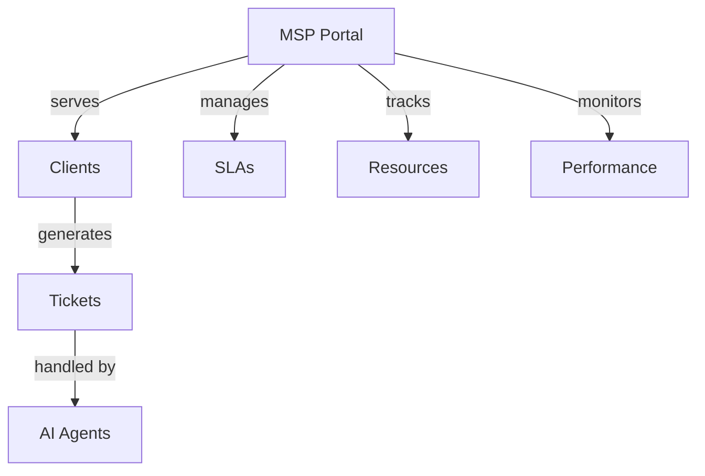

# Managed Service Provider

Rezolve.ai implementation for Managed Service Providers (MSPs).

## Overview

Multi-tenant service management solution for MSPs with AI-powered automation.

_Suggested Image: "msp-overview.png" - MSP service management_

## Implementation

## Key Features

### 1. Client Management
- Multi-tenant setup
- Client portals
- Service catalogs
- SLA management
- Resource allocation

### 2. Service Delivery
- AI triage
- Smart routing
- Knowledge integration
- Automation workflows
- Performance tracking

_Suggested Image: "msp-delivery.png" - Service delivery flow_

## Success Metrics

### 1. Performance Indicators
- Resolution time
- SLA compliance
- Client satisfaction
- Team efficiency
- Resource utilization

### 2. Business Impact
- Service quality
- Cost efficiency
- Client retention
- Revenue growth
- Resource optimization

_Suggested Image: "msp-metrics.png" - Analytics dashboard_

## Related Topics
- [Ticket Automation](../ai-features/ticket-automation)
- [Integration](../portal/integration)
