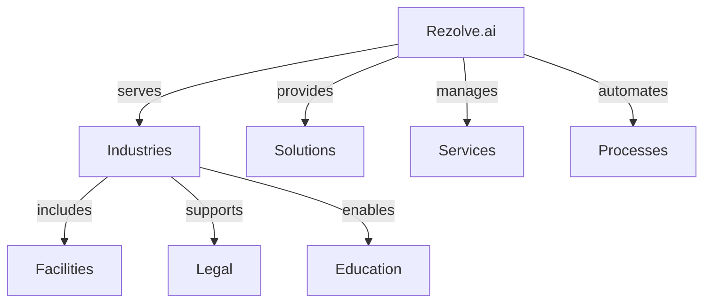

# Other Use Cases

Additional implementation scenarios for Rezolve.ai.

## Overview

Exploring various industry-specific applications of Rezolve.ai.

_Suggested Image: "use-cases-overview.png" - Industry applications_

## Implementation Scenarios

## Key Applications

### 1. Facilities Management
- Maintenance requests
- Space management
- Asset tracking
- Vendor management
- Compliance tracking

### 2. Legal Services
- Case management
- Document handling
- Client communication
- Workflow automation
- Compliance tracking

### 3. Education Services
- Student support
- Faculty assistance
- Resource management
- Course administration
- IT support

_Suggested Image: "industry-solutions.png" - Solution architecture_

## Success Metrics

### 1. Performance Indicators
- Resolution time
- Service quality
- User satisfaction
- Process efficiency
- Resource utilization

### 2. Business Impact
- Cost reduction
- Service improvement
- User experience
- Resource optimization
- Compliance adherence

_Suggested Image: "success-metrics.png" - Analytics dashboard_

## Related Topics
- [Bot Agents](../ai-features/bot-agents)
- [Knowledge Management](../core-concepts/knowledge)
- [Workflow Automation](../core-concepts/automation-workflows)
- [Integration](../portal/integration)
