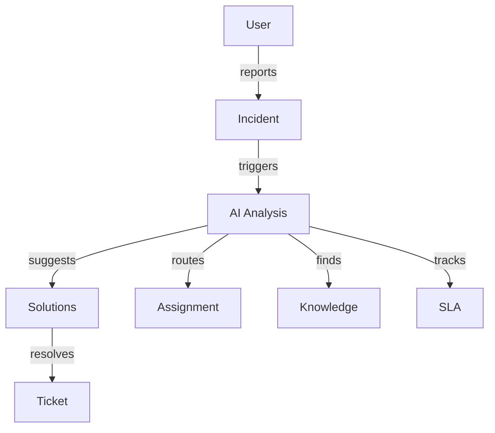
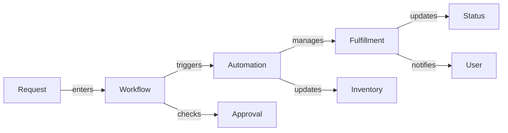
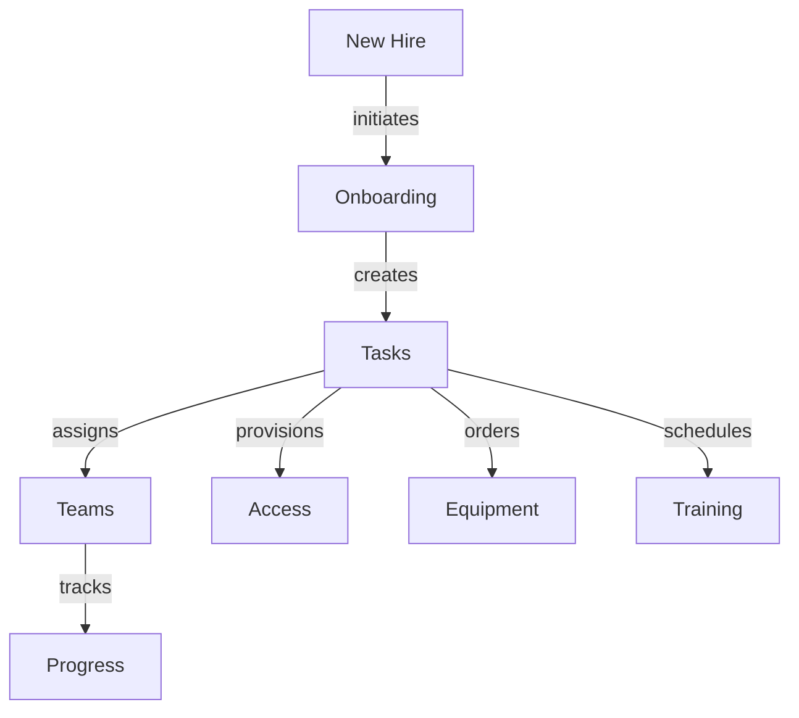
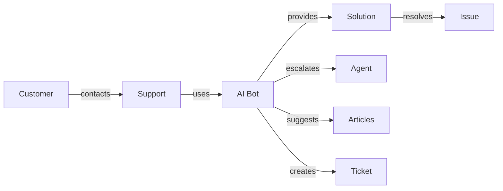
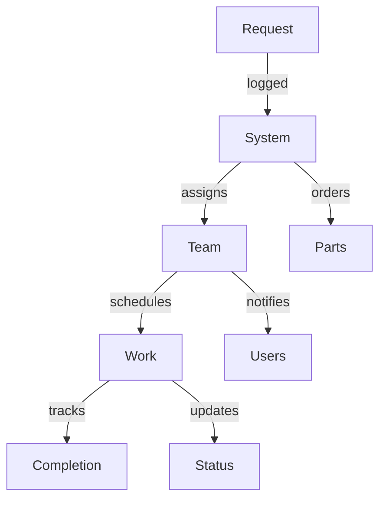
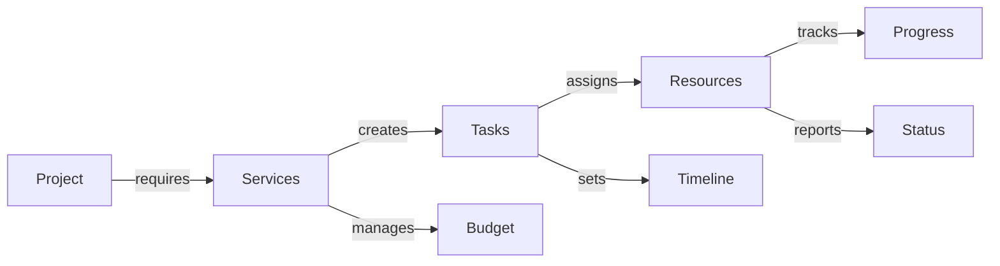

# Use Cases

Explore real-world applications and implementation scenarios for Rezolve.ai.

## Overview

Rezolve.ai supports various service management scenarios across different industries and organizational needs.

_Suggested Image: "use-cases-overview.png" - Use cases overview_

## IT Service Desk

### 1. Incident Management

Features:
- AI-powered triage
- Automated categorization
- Smart routing
- Solution suggestion
- SLA management

### 2. Service Request Handling

Components:
- Request catalog
- Approval workflows
- Automated fulfillment
- Status tracking
- User communication

_Suggested Image: "service-desk.png" - Service desk workflow_

## HR Service Management

### 1. Employee Onboarding

Process:
- Task automation
- Resource provisioning
- Access management
- Progress tracking
- Documentation

### 2. HR Request Management
- Leave requests
- Benefits inquiries
- Policy questions
- Document requests
- Training enrollment

_Suggested Image: "hr-management.png" - HR service portal_

## Customer Support

### 1. Customer Service

Features:
- Multi-channel support
- AI-powered responses
- Knowledge integration
- Ticket management
- Customer feedback

### 2. Knowledge Management
- Article creation
- Content optimization
- Usage analytics
- Feedback loop
- Version control

_Suggested Image: "customer-support.png" - Support interface_

## Facilities Management

### 1. Maintenance Requests

Process:
- Request tracking
- Resource allocation
- Schedule management
- Status updates
- Cost tracking

### 2. Space Management
- Booking system
- Capacity planning
- Asset tracking
- Maintenance scheduling
- Compliance checks

_Suggested Image: "facilities-management.png" - Facilities dashboard_

## Project Management

### 1. Project Services

Features:
- Task automation
- Resource management
- Timeline tracking
- Budget control
- Status reporting

### 2. Collaboration Tools
- Team communication
- Document sharing
- Progress tracking
- Issue management
- Reporting tools

_Suggested Image: "project-management.png" - Project dashboard_

## Implementation Examples

### 1. Enterprise Deployment
- Multi-department setup
- Integration strategy
- Change management
- User training
- Performance monitoring

### 2. Department-Specific
- Customized workflows
- Specialized forms
- Role configuration
- Report templates
- KPI tracking

_Suggested Image: "implementation-examples.png" - Deployment scenarios_

## Success Metrics

### 1. Performance Indicators
- Resolution time
- Customer satisfaction
- Agent productivity
- Knowledge usage
- Automation rate

### 2. Business Impact
- Cost reduction
- Efficiency gains
- User satisfaction
- Resource optimization
- Service quality

_Suggested Image: "success-metrics.png" - Analytics dashboard_

## Related Topics
- [Service Portal](../portal/overview)
- [Security & Access](../security/overview)
- [Bot Agents](../ai-features/bot-agents)
- [Knowledge Management](../core-concepts/knowledge)
