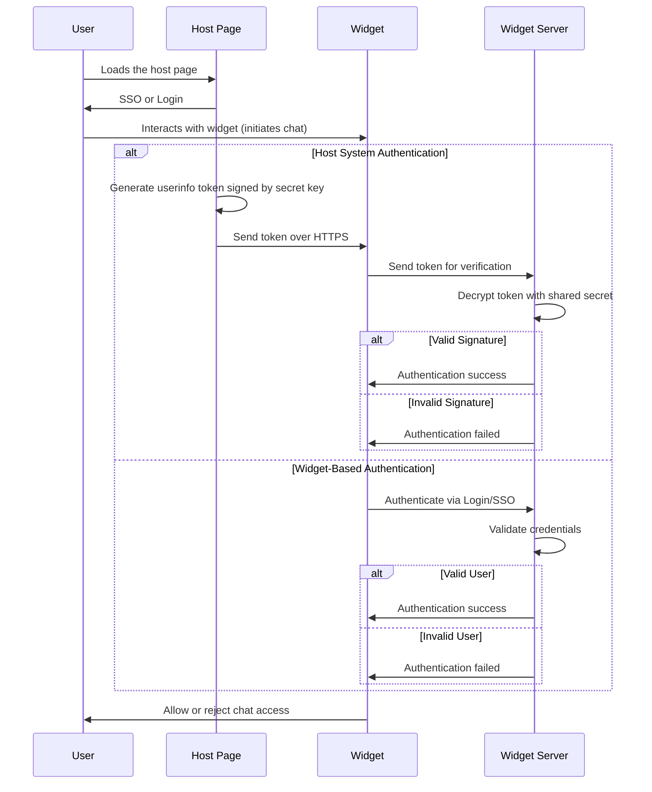

# Chat Widget Authentication

## Overview

The chat widget requires user authentication before allowing interaction. This ensures that only valid users can initiate a chat session. Authentication can be handled in two ways:

1.  **Host System Authentication** – The host system generates and signs a token with user details, which is verified by the widget server.
    
2.  **Widget-Based Authentication** – The widget itself performs user authentication via login or Single Sign-On (SSO).
    

## Authentication Flow
-----------------------

### Step 1: User Loads the Host Page

*   The user navigates to the host webpage where the widget is embedded.
    
*   The host page may prompt the user to log in or authenticate via SSO.
    

### **Step 2: User Initiates Chat**

*   The user interacts with the widget to start a chat session.
    
*   At this point, authentication is required before proceeding further.
    

**Method 1: Host System Authentication**
----------------------------------------

In this method, the **host system is responsible for user authentication**.

1.  The host system generates a **userinfo token**, signed using a secret key.
    
2. This token is set to the **widget** within the page's script.

3.  The widget forwards the token to the **widget server** for verification securely over **HTTPS**.
    
4.  The widget server **decrypts the token** using a shared secret (configured on both the host system and widget server).
    
5.  If the token’s signature is **valid**, authentication is successful.
    
6.  If the signature is **invalid**, authentication fails, and chat access is denied.
    

### **Security Considerations**

*   The token is signed, ensuring its integrity and authenticity.
    
*   Data is transmitted securely over HTTPS to prevent interception.
    
*   The secret key is shared securely between the host system and widget server.
    

**Method 2: Widget-Based Authentication**
-----------------------------------------

In this method, the **widget itself handles authentication**.

1.  The widget prompts the user to log in or authenticate via SSO.
    
2.  The credentials are sent to the **widget server** for validation.
    
3.  The widget server checks if the credentials are correct.
    
4.  If authentication is **successful**, chat access is granted.
    
5.  If authentication **fails**, access is denied.
    

### **Attack Scenarios & Why They Fail**
| Attack | Why It Fails |
|--------|--------------|
| A malicious system generates a fake token | The widget server will **reject it** because it lacks a valid signature (requires the secret key). |
| A stolen token is reused after expiration | The token has a **short expiry** and cannot be reused. |
| An attacker intercepts a token over HTTP | HTTPS encryption prevents eavesdropping. |
| Another system embeds the widget | Widget server will reject it because it lacks a valid signature (secret key is unknown). |
